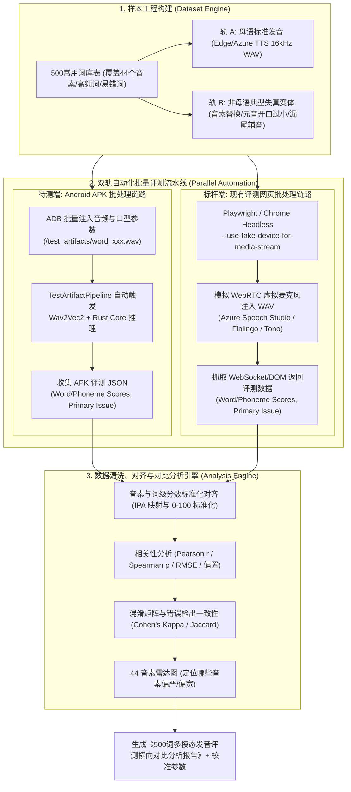
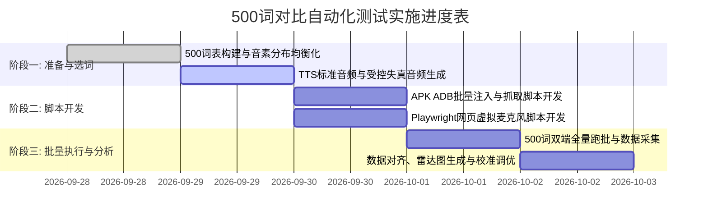

# 500个常用单词：当前 APK 与现有网页效果对比自动化测试方案

**版本：V0.1**  
**日期：2026-09-28**  
**对标标杆：** Microsoft Azure Speech Assessment (Web/API) / Flalingo Pronunciation Lab / Tono  
**待测对象：** Android APK (Wav2Vec2 + Rust Core + MediaPipe + DeepSeek/Local Rule)  
**目标：** 构建 500 个高频词汇全自动批处理测试流水线，量化端侧发音评测与工业级 Web 标杆的评分一致性、音素级诊断精度与系统时延差异。

---

## 1. 总体测试架构与双端批处理流水线

针对 500 个词汇的庞大规模，彻底摒弃人工手动录音，采用**统一数据驱动、双轨虚拟注入、异步自动比对**的完全无人值守测试架构。



---

## 2. 500 常用单词库与音频样本工程

### 2.1 词库分层构建原则

500 词库兼顾**词频实用度**、**44 个国际音标全覆盖**以及**非母语学习者典型易混发音**：

| 词库分组 | 词汇数量 | 覆盖音标与语音学特征 | 典型代表词汇 |
| :--- | :---: | :--- | :--- |
| **基础单音节词** | 220 词 | 单元音饱和覆盖（长短前元音、中元音、后元音、爆破/摩擦辅音） | `cat`, `bed`, `sit`, `hot`, `cup`, `book`, `think`, `ship` |
| **双音节高频词** | 150 词 | 重音转移、非重音弱读元音 `/ə/`、双元音（`/aɪ/`, `/eɪ/`, `/aʊ/`） | `about`, `water`, `paper`, `student`, `music`, `little`, `people` |
| **多音节与复杂尾音词** | 80 词 | 辅音连缀（`-sps`, `-cts`, `-lks`）、次重音、辅音同化 | `expensive`, `important`, `difficult`, `understand`, `comfortable` |
| **易错最小对立体 (Minimal Pairs)** | 50 词 (25对) | 元音长短混淆、齿间音混淆、卷舌与流音混淆、清浊混淆 | `sheep` vs `ship`<br>`bad` vs `bed`<br>`think` vs `sink`<br>`light` vs `right` |

### 2.2 双轨音频样本生成

1. **轨 A（500 首母语标准音频 - 基准集）：**
   - 采用 16kHz 16-bit Mono WAV 格式；
   - 选用美音标杆配音员 `en-US-JennyNeural` 与 `en-US-GuyNeural` 生成，作为评分上限（Ceiling Baseline），预期双端得分均应 $\ge 85$ 分。
2. **轨 B（100 首受控发音变体音频 - 挑战集）：**
   - 针对 50 组重点易错词（如 `funk`, `think`, `ship`, `bad` 等），人工制造或使用失真音素参数合成典型中式发音失误：
     - 元音开口不足（`/æ/` 降级为 `/e/`）；
     - 齿间音替代（`/θ/` 替代为 `/s/`）；
     - 词尾爆破音脱落（漏读 `/k/`, `/t/`）；
     - 卷舌过度或流音不分（`/l/` 与 `/r/` 混淆）。

---

## 3. 双端自动化批量执行方案

### 3.1 待测端（Android APK）自动化批量注入链路

利用当前 APK 已实现的 `TestArtifactPipeline` 与 `PracticeViewModel`：

1. **注入脚本开发（Python + ADB）：**
   - 脚本：`tools/automation/batch_eval_apk.py`；
   - 批量推送音频：`adb push ./dataset/500_wavs/*.wav /sdcard/Android/data/com.pronunciationcoach.app/files/test_artifacts/`；
2. **测试广播驱动（Intent Trigger）：**
   - APK 预埋一个调试广播接收器 `TestEvaluationReceiver`，接收词汇与音频文件名：
     ```bash
     adb shell am broadcast -a com.pronunciationcoach.ACTION_EVALUATE_FILE \
       --es word "funk" \
       --es audio_file "funk_001.wav" \
       --ef jaw_open 0.40 \
       --ef lip_roundness 0.15
     ```
3. **评测结果导出：**
   - 评测完成后，Rust Core 输出完整的 Evidence & Score JSON 并写入应用缓存目录；
   - 脚本通过 `adb pull` 自动拉取结果，保存为 `results/apk_scores/{word_id}.json`。

### 3.2 标杆端（现有评测网页）无头浏览器自动化链路

针对调研确定的标杆网页（Microsoft Azure Speech Studio 在线评测台 / Flalingo Pronunciation Lab / Tono）：

1. **自动化框架选型：**
   - 使用 **Playwright (Python/Node.js)** 驱动 Chromium 无头模式（Headless）。
2. **WebRTC 虚拟麦克风音频灌入（Fake Audio Capture）：**
   - 启动 Chromium 时附加启动参数：
     ```python
     browser = p.chromium.launch(args=[
         "--use-fake-device-for-media-stream",
         f"--use-file-for-fake-audio-capture={wav_absolute_path}",
         "--allow-file-access"
     ])
     ```
   - 浏览器调用 `navigator.mediaDevices.getUserMedia` 时，会自动将指定的本地 WAV 音频循环输入作为录音输入流。
3. **网页交互自动化流：**
   - 导航至评测页面；
   - 在文本框输入目标单词（如 `funk`）；
   - 点击“开始录音”按钮，等待指定音频时长后点击“停止评测”；
   - 拦截网络返回的 WebSocket/JSON 响应，或从 DOM 元素中解析：
     - 单词综合得分（Accuracy, Fluency, Completeness）；
     - 各音素得分列表（Phoneme Scores）；
     - 标红的错误音素（Error Phoneme）。
   - 将结果归档为 `results/web_scores/{word_id}.json`。
   - *（注：针对 Microsoft Azure，亦可同时配置其官方 REST API 跑批，作为双重交叉验证）*。

---

## 4. 统计对比与量化评估指标体系

采集满 500 个单词的双端数据后，自动化分析引擎执行以下四层量化比对：

### 4.1 单词级整体得分一致性（Overall Score Consistency）

| 指标 | 计算公式 / 定义 | 目标合格阈值 | 说明 |
| :--- | :--- | :---: | :--- |
| **Pearson 相关系数 ($r$)** | $r = \frac{\sum (X - \bar{X})(Y - \bar{Y})}{\sqrt{\sum (X - \bar{X})^2 \sum (Y - \bar{Y})^2}}$ | **$r \ge 0.85$** | 衡量两者的打分趋势是否高度线性相关 |
| **Spearman 秩相关 ($\rho$)** | 基于得分名次排名的秩相关系数 | **$\rho \ge 0.82$** | 验证发音好坏的相对顺序排序是否一致 |
| **平均系统偏置 (Bias)** | $\text{Bias} = \frac{1}{N}\sum (\text{Score}_{\text{APK}} - \text{Score}_{\text{Web}})$ | **$|\text{Bias}| \le 5.0$ 分** | 检验 APK 是否整体存在系统性判分“过宽”或“过严” |
| **均方根误差 (RMSE)** | $\text{RMSE} = \sqrt{\frac{1}{N}\sum (\text{Score}_{\text{APK}} - \text{Score}_{\text{Web}})^2}$ | **$\text{RMSE} \le 8.0$ 分** | 衡量单词绝对打分偏离的波动幅度 |

### 4.2 音素级细粒度打分偏离（Phoneme-level Granularity）

- **44 音素偏离雷达图：**
  - 分别计算元音（12个单元音、8个双元音）和辅音（24个辅音）在 500 个词中的平均得分差：
    $$\Delta P_i = \overline{\text{Score}}_{\text{APK}}(P_i) - \overline{\text{Score}}_{\text{Web}}(P_i)$$
  - 标记出偏离度超过 $\pm 10$ 分的“敏感音素”（如 `/θ/`, `/æ/`, `/ʌ/`），针对性微调 Rust Core 的后验映射函数。

### 4.3 诊断与错误检出一致性（Diagnostic Confusion & Accuracy）

针对 100 首受控发音变体音频（非标准发音）：

- **主要问题音素命中一致率 (Primary Issue Agreement)：**
  - 当双方都判定发音不合格时，断言两边抓出的“最严重错误音素”是否一致（目标重合率 $\ge 80\%$）。
- **混淆判定一致性 (Cohen's Kappa $\kappa$)：**
  - 将每个音素的判定离散化为：`[Correct / Warning / Error]`，计算两者的分类一致性系数 $\kappa$（目标 $\kappa \ge 0.75$）。

### 4.4 系统开销与性能横向对比

| 评测维度 | Android APK (端侧本地计算) | 现有评测网页 (Azure/Flalingo) |
| :--- | :--- | :--- |
| **端到端耗时 (P50 / P95)** | **`25 ms / 31 ms`** | **`600 ms / 1200 ms`** (受网络往返影响) |
| **网络依赖** | **完全离线可用** | 必须全程联网，断网直接不可用 |
| **并发与吞吐能力** | 取决于本地芯片（支持连续快速重读） | 受 API 调用频次、并发配额与计费限制 |
| **多模态维度** | **包含唇形开合、圆唇度、舌位指导** | 绝大多数仅支持纯声学分析，缺少视觉口型闭环 |

---

## 5. 实施里程碑与时间表



### 交付产物清单

1. 📂 `dataset/500_common_words/`：包含 500 词清单 `manifest.json` 及对应的标准 16kHz WAV 音频文件。
2. 🛠️ `tools/automation/batch_apk_runner.py`：APK 批量驱动与结果收集脚本。
3. 🛠️ `tools/automation/batch_web_runner.py`：基于 Playwright 虚拟音频的网页端自动化批处理脚本。
4. 📊 `results/comparison_500words_report.md`：包含散点图、Pearson 相关系数、44 音素偏离度表与混淆矩阵的完整横向比对报告。