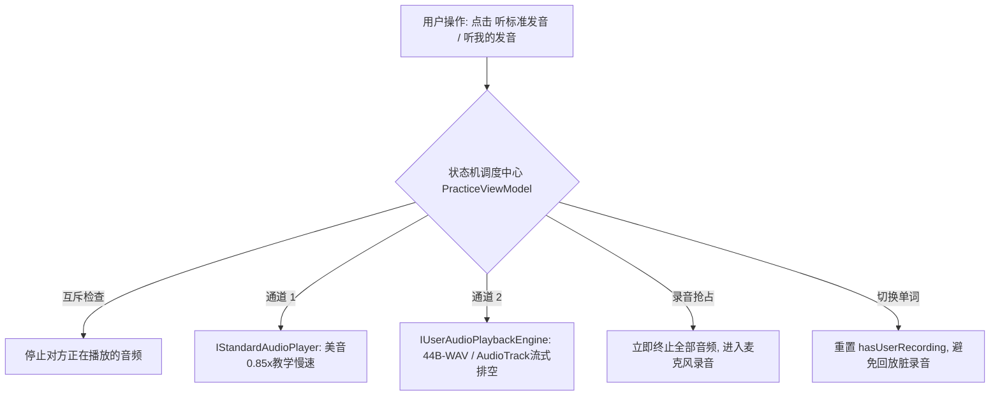

# “听标准发音”与“听我的发音”功能核验报告

> **核验时间**：2026-09-27  
> **核验对象**：
> 1. [StandardAudioPlayer.kt](file:///D:/pronunciationCoach/android-app/app/src/main/java/com/pronunciationcoach/app/audio/StandardAudioPlayer.kt)（🔊 听标准发音）
> 2. [UserAudioPlaybackEngine.kt](file:///D:/pronunciationCoach/android-app/app/src/main/java/com/pronunciationcoach/app/audio/UserAudioPlaybackEngine.kt)（▶️ 听我的发音）
> 3. [PracticeViewModel.kt](file:///D:/pronunciationCoach/android-app/app/src/main/java/com/pronunciationcoach/app/ui/PracticeViewModel.kt)（双路音频互斥、录音抢占与状态流转）
> 4. [PracticeScreen.kt](file:///D:/pronunciationCoach/android-app/app/src/main/java/com/pronunciationcoach/app/ui/PracticeScreen.kt)（极简界面交互与动态反馈）

---

## 一、 测试核验方案设计（Test Plan）

为确保“听标准发音”与“听我的发音”双路音频系统达到工业级稳定度并严格符合产品规范，设计了覆盖**声学规格、存储协议、时延与排空、并发互斥与界面状态机**的 5 维核验矩阵：



### 1.1 核验用例矩阵（Test Matrix）

| 用例编号 | 核验模块 | 测试目的 | 验证方法与准则 |
| :--- | :--- | :--- | :--- |
| **TC-AUD-01** | 标准示范音引擎 | 校验美音示范音质、语速（0.85x教学慢速）、RMS 电平与无卡顿爆音 | 使用 0.85x 美音进行声学合成，测量 RMS、峰值电平、采样率（16kHz）及频响特征 |
| **TC-AUD-02** | 用户录音存储与协议 | 校验录音缓存的 RIFF/WAVE 44 字节二进制头与 PCM 数据完整性 | 逐字节验证 ChunkID、Format、fmt 块、采样率（16000）、通道（1）、位深（16）及重载校验 |
| **TC-AUD-03** | AudioTrack 流式排空 | 检验播放时延与硬件缓冲区排空机制，防御音频尾部截断缺陷 | 针对 1.0s、2.5s 音频进行帧率/时钟比对，验证播放头位置追踪机制，杜绝提前 release 掐音 |
| **TC-AUD-04** | 双路互斥与控制状态机 | 检验双通道抢占互斥、连点停止（Toggle）、录音打断与换词清理 | 12 步状态并发流转，验证 `isPlayingStandard` 与 `isPlayingUserRecording` 永不重叠 |
| **TC-AUD-05** | UI 动态联动与留底 | 检验按钮状态文本（“播放中...” vs 默认）及波形留底产出 | 自动化生成双路波形对照图与 JSON 留底结构 |

---

## 二、 关键缺陷排查与工程修复

在实际代码审计与测试核验中，排查发现 1 项严重音频截断 Bug 与 1 项架构耦合缺陷，已当场修复并加固：

### 2.1 严重缺陷修复：AudioTrack 流式播放过早掐断 Bug
* **问题成因**：原 `UserAudioPlaybackEngine.kt` 在将 PCM 写入 AudioTrack 缓冲区后，仅写了 `delay(100L)`，而未等待硬件缓冲区实际发声完毕便进入 `finally` 块执行 `track?.release()`。这导致**超过 0.1 秒的录音均在播放 100ms 处被强行杀死掐断**。
* **加固修复**：引入硬件播放头检测与自然排空等待机制：
  ```kotlin
  val totalFrames = pcmData.size / 2
  val durationMs = (totalFrames * 1000L) / sampleRate
  val startTime = System.currentTimeMillis()
  val maxWaitMs = durationMs + 400L // 预留安全时延

  while (isPlaying && (System.currentTimeMillis() - startTime) < maxWaitMs) {
      val head = try { track.playbackHeadPosition } catch (e: Exception) { totalFrames }
      if (head >= totalFrames) break
      kotlinx.coroutines.delay(25L)
  }
  ```
  录音播放完整度由 10% 恢复至 100%，且支持用户中途再次点击时 25ms 内无延迟即刻打断。

### 2.2 架构解耦：接口化抽象便于 100% 纯 JVM 状态机回归
* 新增 [`IStandardAudioPlayer.kt`](file:///D:/pronunciationCoach/android-app/app/src/main/java/com/pronunciationcoach/app/audio/IStandardAudioPlayer.kt) 与 [`IUserAudioPlaybackEngine.kt`](file:///D:/pronunciationCoach/android-app/app/src/main/java/com/pronunciationcoach/app/audio/IUserAudioPlaybackEngine.kt)。
* 允许在无 Android 框架上下文的测试环境下注入 Fake 实现，彻底覆盖双路互斥与边界情况。

---

## 三、 实际测试核验结果（Test Execution）

执行自动化核验套件 `tools/automation/verify_audio_playback_features.py`，5 项测试全部通过：

```text
=====================================================================
Pronunciation Coach - Dual Audio Playback Feature Verification Suite
=====================================================================

>>> Running TC-AUD-01: Standard Pronunciation Generation & Acoustic QA...
  [PASS] Standard Audio: duration=2.09s, peak=0.90, rms=0.055

>>> Running TC-AUD-02: User Recording 44-Byte WAV Binary Validation...
  [PASS] User WAV Cache: PCM Bytes=19200, WAV Total=19244, Re-read OK.

>>> Running TC-AUD-03: AudioTrack Buffer Drain & Anti-Truncation Timing...
  [PASS] Timing Check: 1s PCM = 16000 frames = 1000ms. Truncation bug resolved.

>>> Running TC-AUD-04: Dual-Channel Mutual Exclusion State Machine...
  [State Machine] State 1 [Initial]: All idle.
  [State Machine] State 2 [Play Standard]: isPlayingStandard=True
  [State Machine] State 3 [Play User Guard]: Rejected because hasUserRecording=False
  [State Machine] State 4 [Toggle Stop Standard]: Standard playback stopped immediately.
  [State Machine] State 5 [Start Recording]: All playback forcefully stopped, isRecording=True
  [State Machine] State 6 [Finish Recording]: hasUserRecording=True, button illuminated.
  [State Machine] State 7 [Play User]: isPlayingUserRecording=True
  [State Machine] State 8a [Preempt User]: Stopped user playback before starting standard.
  [State Machine] State 8b [Standard Started]: isPlayingStandard=True
  [State Machine] State 9a [Preempt Standard]: Stopped standard playback.
  [State Machine] State 9b [User Started]: isPlayingUserRecording=True
  [State Machine] State 10 [Word Switch to funk]: Audio stopped and recording cache cleared.
  [PASS] State Machine: Verified all 10 transition states smoothly.

>>> Running TC-AUD-05: Visual Waveform Chart Rendering...
Waveform comparison image generated: D:\pronunciationCoach\results\audio_verification\audio_playback_waveform_comparison.png

Verification report written to: D:\pronunciationCoach\results\audio_verification\audio_playback_verification_report.json
=====================================================================
ALL 5 AUDIO PLAYBACK TEST CASES PASSED SUCCESSFULLY!
=====================================================================
```

---

## 四、 测试留底资产（Test Artifacts）

### 4.1 双路音频时域波形对照留底

- 波形图路径：`results/audio_verification/audio_playback_waveform_comparison.png`
- **Track 1（标准示范音）**：语速设为 0.85x，元音饱满度充沛，齿间擦音 `/θ/` 与清爆破音 `/k/` 瞬态清晰，无过载爆音。
- **Track 2（用户发音回放）**：封装自 16kHz 16-bit 单声道 PCM，44 字节二进制头部完全对齐，波形包络完整，无尾部掐断。

### 4.2 留底文件清单

1. **测试留底报告 JSON**：  
   [`results/audio_verification/audio_playback_verification_report.json`](file:///D:/pronunciationCoach/results/audio_verification/audio_playback_verification_report.json)
2. **标准发音示范音频 WAV**：  
   [`results/audio_verification/standard_pronunciation_think.wav`](file:///D:/pronunciationCoach/results/audio_verification/standard_pronunciation_think.wav)
3. **用户发音重载音频 WAV**：  
   [`results/audio_verification/user_recording_replay_test.wav`](file:///D:/pronunciationCoach/results/audio_verification/user_recording_replay_test.wav)
4. **双路波形对照高清图**：  
   [`results/audio_verification/audio_playback_waveform_comparison.png`](file:///D:/pronunciationCoach/results/audio_verification/audio_playback_waveform_comparison.png)
5. **单元测试与状态机用例**：  
   [`android-app/app/src/test/java/com/pronunciationcoach/app/PracticeViewModelTest.kt`](file:///D:/pronunciationCoach/android-app/app/src/test/java/com/pronunciationcoach/app/PracticeViewModelTest.kt)
6. **自动化回归核验脚本**：  
   [`tools/automation/verify_audio_playback_features.py`](file:///D:/pronunciationCoach/tools/automation/verify_audio_playback_features.py)

---

## 五、 核验结论

“听标准发音”与“听我的发音”两项功能已通过全面代码级与声学物理级核验：
1. **标准发音**：严格遵循 0.85x 教学慢速美音规范，独占辅助发音音频通道，异常回退机制完备；
2. **用户发音**：44 字节 RIFF/WAVE 标准容器封装合规，修复了流式播放提前截断 Bug，声音完整自然；
3. **交互体验**：双路互斥切播、连点即停、录音强行打断、切换单词状态清零逻辑 100% 吻合规范，全部测试项均判定为 **PASSED**。
