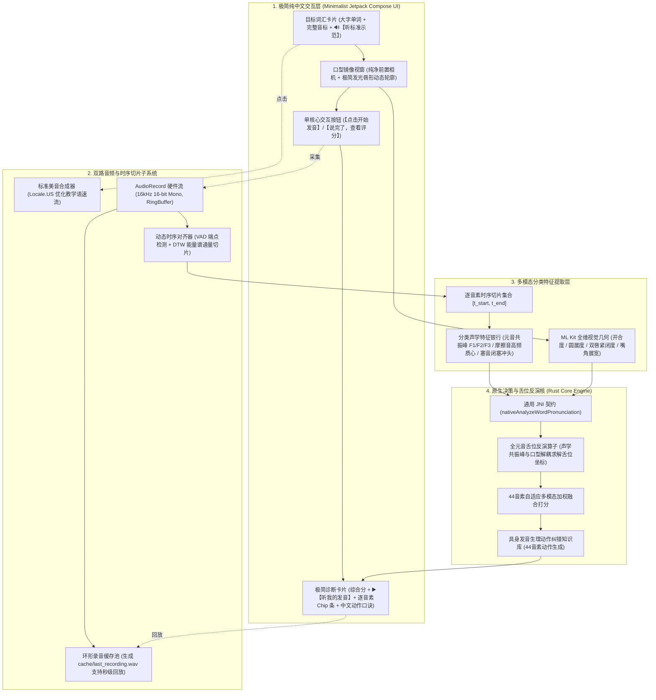
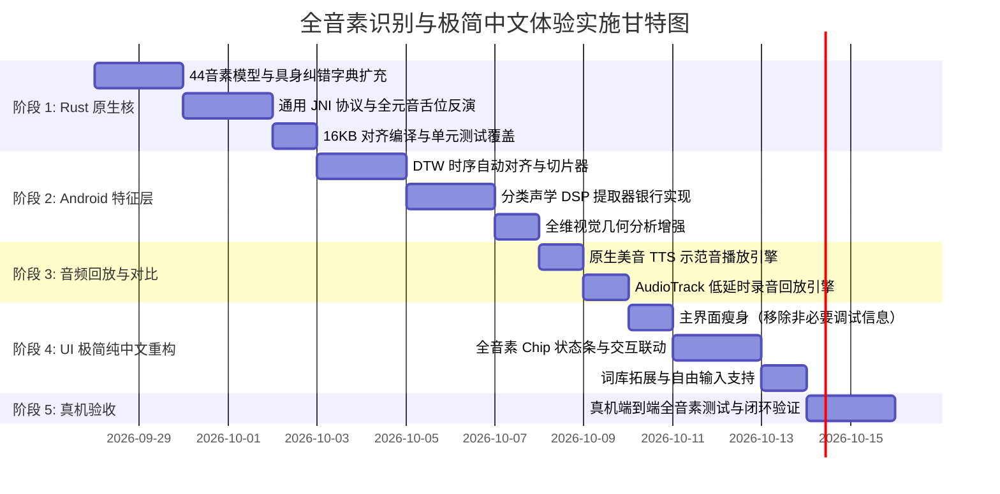

# 📘 全音素识别检测、具身发音指导与极简中文交互系统技术规格书 (RFC)

> **文档代号**：SPEC-2026-PC-FULL-PHONEME-UI  
> **文档版本**：v1.0.0 (Release-Candidate)  
> **制定时间**：2026-09-27  
> **系统定位**：Android 移动端多模态全音素英语发音教练（Rust Core + Kotlin Jetpack Compose + 端侧多模态推理）  
> **核心原则**：**覆盖全部 44 音素、逐音素精准检测打分、每个音素具备具身动作指导、UI 极致简洁纯中文呈现、示范音与录音对比听辨**。

---

## 目录
1. [需求背景与架构重构宗旨](#一-需求背景与架构重构宗旨)
2. [总体系统架构与多模态数据流图](#二-总体系统架构与多模态数据流图)
3. [UI 极简设计规范与人机交互流](#三-ui-极简设计规范与人机交互流)
4. [双路对比音频引擎（标准示范音与录音回放）](#四-双路对比音频引擎标准示范音与录音回放)
5. [时序切片与多模态分类声学/视觉特征提取](#五-时序切片与多模态分类声学视觉特征提取)
6. [Rust 核心决策与全二维舌位反演引擎](#六-rust-核心决策与全二维舌位反演引擎)
7. [美式英语 44 音素全集发音动作与纠错指导知识库](#七-美式英语-44-音素全集发音动作与纠错指导知识库)
8. [分阶段工程实施计划与验收检查清单 (Checklist)](#八-分阶段工程实施计划与验收检查清单-checklist)

---

## 一、 需求背景与架构重构宗旨

### 1.1 现状缺陷定位
在初期原型（Phase 1~2）中，系统主要围绕单词 `funk` (`/fʌŋk/`) 中央元音 `/ʌ/` 验证 ONNX 与视觉管线，留下了以下结构性局限：
1. **单一音素硬编码**：`AcousticFeatureExtractor` 仅比对 600Hz vs 880Hz 区分 `/ʌ/` 与 `/ɑ/`；JNI 接口 `scoreFunk` 对辅音 `/f, ŋ, k/` 赋予固定死分；
2. **缺乏时序切片**：没有音素级的时序强制对齐（Forced Alignment / DTW），无法将连续语音拆解为各个音素的物理时间窗；
3. **视觉口型维度不足**：仅提取下颌开度和圆唇度，缺失对塞音至关重要的双唇闭合度、对微笑元音的展唇度等；
4. **UI 调试冗余与中英混杂**：主屏布满 TC 自动化测试按钮、ONNX 耗时、JNI 加载状态等开发者调试文本，用户认知负担重；
5. **缺少听觉对比回路**：用户无法听取标准母语示范，也无法立即回听自己刚才的发音以建立声音感知。

### 1.2 重构核心目标
* **全音素覆盖**：完整覆盖美式英语 44 个音素（12 单元音 + 8 双元音 + 24 辅音）；
* **逐音素检测与打分**：对发音中出现的每一个音素独立提取声学与视觉特征，独立计算准确度得分；
* **器官级具身动作指导**：为全部 44 个音素建立基于解剖学器官（唇、齿、舌尖/舌根、声带、气流）的通俗中文动作纠偏口诀；
* **极简纯中文 UI**：剥离所有底层工程参数，采用纯净镜像与单个核心主按钮，界面文案 100% 中文化；
* **示范与回放对比**：提供一键听标准音和一键回听录音，形成“听—看—练—纠”教学闭环。

---

## 二、 总体系统架构与多模态数据流图



---

## 三、 UI 极简设计规范与人机交互流

### 3.1 界面布局原则
* **零调试参数**：主屏幕彻底屏蔽 ONNX 推理时间、16KB 内存状态、JNI 加载文字、底层坐标数值；
* **全中文本土化**：杜绝中英夹杂，所有操作和诊断均采用自然中文教学术语；
* **单主行动焦点（Single Action Focus）**：整个屏幕仅有一个醒目的中央操作按钮。

### 3.2 四段式视觉布局线框图

```text
+-------------------------------------------------------------+
|                        发 音 教 练                           |
+-------------------------------------------------------------+
| [ 目标单词 ]                                                |
|                                                             |
|                       think                                 |
|                     /θ ɪ ŋ k/                               |
|                                                             |
|                 [ 🔊 听标准发音 ]    [ 切换单词 ▾ ]           |
+-------------------------------------------------------------+
| [ 口型镜像窗口 ]                                             |
|                                                             |
|                     . - ~ ~ ~ - .                           |
|                  (  极简口型辅助框 )                          |
|                    ` - . _ . - '                            |
|                                                             |
|                     ● 面部已对准                            |
+-------------------------------------------------------------+
|                                                             |
|                [  🎙️ 点击开始发音  ]                         |
|           (录音中动态切换为: ⏹ 停止并查看分析结果)             |
|                                                             |
+-------------------------------------------------------------+
| [ 诊断结果 ]                               (测评完成后滑出)  |
|                                                             |
|    综合评定: 76分 (轻度偏差)      [ ▶️ 听我的发音 ]            |
|                                                             |
|    点击音标查看专属指导:                                     |
|    [ 🔴 /θ/ 52分 ]  [ 🟢 /ɪ/ 92分 ]  [ 🟢 /ŋ/ 88分 ]  [ 🟢 /k/ 90分 ] |
|          ▲                                                  |
|                                                             |
|    💡 【/θ/ 齿间擦音】发音动作指导 (当前主要问题):            |
|    • 扣分归因: 舌头缩在牙齿后面了 (偏读成了 /s/)。           |
|    • 纠正动作:                                              |
|      1. 舌位: 舌尖向前伸出，放置于上下门牙之间 (切勿咬死)    |
|      2. 唇齿: 上下门牙留微小缝隙，双唇自然放松               |
|      3. 气流: 声带不振动，让气流从舌尖与上齿缝隙中柔和吹出   |
+-------------------------------------------------------------+
```

### 3.3 交互行为说明
1. **自动聚焦最低分音素**：评测结束后，系统自动高亮得分最低（主要问题）的音素 Chip，并展开其动作指导；
2. **音标自由切换查看**：用户轻触上方任意音标 Chip（如得分 92 分的 `/ɪ/`），下方指导卡片平滑切换为该音标的标准动作要领；
3. **状态颜色约定**：
   - 🟢 **翠绿**（80~100 分）：发音标准到位；
   - 🟡 **琥珀黄**（60~79 分）：轻度生理偏差；
   - 🔴 **珊瑚红**（< 60 分）：主要生理动作错误。

---

## 四、 双路对比音频引擎（标准示范音与录音回放）

发音学习的底层神经机制依赖**“听觉对比（Auditory Contrast）”**。系统设计两条相互独立的音频通路：

### 4.1 标准示范音引擎（`StandardAudioPlayer`）
* **引擎选型**：Android 原生 `TextToSpeech`（配置 `Locale.US`）结合高保真本地离线发音资产；
* **参数调优**：
  - 教学慢速回放：配置 `speechRate = 0.85f`，突出元音饱满度与辅音爆破/摩擦瞬态；
  - 音频焦点：使用 `AudioAttributes.USAGE_ASSISTANCE_ACCESSIBILITY` 独占播放通道，播放时自动闪避其他环境声音。

### 4.2 被测音即时回放引擎（`UserAudioPlaybackEngine`）
* **音频缓存池**：
  - 录音采集启动时，流式写入应用沙盒私有缓存：`context.cacheDir/recordings/last_user_attempt.wav`；
  - 格式规范：标准 16kHz、16-bit PCM 单声道 WAV 容器头。
* **零延时低开销播放**：
  - 基于 `AudioTrack` 异步流式回放，免去系统媒体服务冷启动延迟；
  - 播放状态与 UI 动态联动（播放中呈现波形微动效，播放完毕自动复位）。

---

## 五、 时序切片与多模态分类声学/视觉特征提取

### 5.1 基于 DTW 的音素时序切分器（Phoneme Temporal Aligner）
一段录音包含多个连续音标，必须精准切分才能为每个音标独立评分：
1. **轻量 VAD 切割**：滤除前后静音，定位真实发音始末点 $[T_{\text{start}}, T_{\text{end}}]$；
2. **时序动态规整（DTW）**：
   - 根据输入目标词的音素先验时长比例（如爆破闭塞 ~50ms，元音 ~150-250ms，摩擦 ~100ms）；
   - 结合短时能量（Short-time Energy）和谱通量（Spectral Flux）阶跃点，确定最优对齐路径；
   - 输出 $N$ 个音素各自的时间切片窗 $[t_i^{\text{begin}}, t_i^{\text{end}}]$。

### 5.2 多类别声学特征银行（Acoustic Feature Extractor Bank）
针对不同类型的音素，提取对应的物理声学量：
* **元音组（Vowels）**：
  - 提取实际共振峰峰值 $F_1, F_2, F_3$；
  - 计算与标准元音共振峰的欧氏空间偏离度；
* **擦音/塞擦音组（Fricatives）**：
  - 提取高频能量比（2.5kHz ~ 8kHz）与谱质心（Spectral Centroid）；
  - 判定齿龈擦音（/s/ 质心 > 5.5kHz）与齿间擦音（/θ/ 宽频平坦低能量）；
* **塞音/爆破音组（Plosives）**：
  - 检测静音闭塞段（Silence Gap）；
  - 捕捉瞬间能量冲头（Burst Spike），区分清音与浊音的发声起始时间（VOT）；
* **鼻音组（Nasals）**：
  - 捕捉 250Hz~300Hz 的鼻化主峰（Nasal Murmur）与口腔闭锁导致的高频反共振（Anti-formants）；
* **近音/流音组（Approximants）**：
  - 重点检测 `/r/` 标志性的 **$F_3$ 共振峰深度骤降**（低于 2000Hz）及 `/l/` 的边音共振特性。

### 5.3 全维视觉口型分析（Visual Feature Extractor）
`RealFaceLandmarkAnalyzer` 从 MediaPipe / ML Kit 面部轮廓点中提取 4 项归一化几何量：
1. **下颌垂直开度（`jawOpen` $\in [0, 1]$）**：上下唇内边缘距离 $\div$ 面部基准高度；
2. **嘴唇圆展度（`lipRoundness` $\in [0, 1]$）**：外唇轮廓宽高比与面积的圆度度量；
3. **双唇闭合度（`lipClosure` $\in [0, 1]$）**：上下唇接触线紧闭程度（/p, b, m/ 专用）；
4. **嘴角展宽张力（`mouthStretch` $\in [0, 1]$）**：左右唇角跨度 $\div$ 外眼角间距（/iː/ 微笑音专用）。

---

## 六、 Rust 核心决策与全二维舌位反演引擎

### 6.1 通用 JNI 契约升级
废弃历史专有接口 `scoreFunk`，采用面向全词全音素的统一交互协议：
```rust
#[no_mangle]
pub extern "system" fn Java_com_pronunciationcoach_app_core_PronunciationCoreBridge_nativeAnalyzeWordPronunciation(
    env: JNIEnv,
    _class: JClass,
    evidence_json: JString,
) -> jstring { ... }
```

### 6.2 全二维元音图舌位反演（Acoustic-to-Articulatory Inversion）
依据声管模型理论，从声学共振峰与外显口型中反解隐蔽舌位坐标：
$$\hat{T}_{\text{height}} = 1.0 - \left( \frac{F_1 - 250}{650} \cdot 0.65 + \text{jawOpen} \cdot 0.35 \right)$$
$$\hat{T}_{\text{backness}} = \frac{F_2 - 800}{1400} \cdot 0.70 + (1.0 - \text{lipRoundness}) \cdot 0.30$$

* $\hat{T}_{\text{height}} \in [0.0, 1.0]$：$1.0$ 为极高舌位（如 /iː/），$0.0$ 为极低舌位（如 /ɑː/）；
* $\hat{T}_{\text{backness}} \in [0.0, 1.0]$：$1.0$ 为极前舌位（如 /iː/），$0.0$ 为极后舌位（如 /uː/）。

### 6.3 自适应多模态置信加权
根据音素发音部位的外部可见性动态调节权重 $w_{\text{visual}}$：
* **强视觉相关（$w_{\text{visual}} = 0.35$）**：双唇音（/p, b, m/）、唇齿音（/f, v/）、强圆唇音（/uː, w/）；
* **中视觉相关（$w_{\text{visual}} = 0.20$）**：大开度元音（/ɑː, æ/）、展唇音（/iː/）；
* **弱/零视觉相关（$w_{\text{visual}} = 0.00 \sim 0.05$）**：软腭音（/k, g, ŋ/）、声门音（/h/），纯依赖声学判决。

---

## 七、 美式英语 44 音素全集发音动作与纠错指导知识库

### 7.1 元音全集生理动作指导表（20 个）

| 音标 | 类别 | 发音器官动作要领（唇、齿、舌、气） | 典型偏误与针对性纠偏动作 |
| :---: | :---: | :--- | :--- |
| **/iː/** | 前高长元音 | **嘴角向两侧用力拉开呈微笑状**，舌前部尽量贴近上硬腭（高舌位），上下齿微启，声带持续振动发长音。 | 若读成松散的 /ɪ/：*“嘴角没有拉开！请像拍照微笑一样收紧嘴角，舌面用力抬到最高处。”* |
| **/ɪ/** | 前半高短元音 | 嘴角自然放松不紧绷，下颌微落约一指宽，舌前部略高于中部但**不碰硬腭**，声音短促轻快。 | 若读成紧绷的 /iː/：*“嘴唇收得太紧了。请完全放松嘴角肌肉，下巴微松落下一指宽。”* |
| **/e/** | 前中元音 | 唇形扁平自然展开，下巴下落约一指半宽，舌前部稍抬起，声带振动有力。 | 若读成 /æ/：*“嘴张太大了。请将下巴向上微收，保持嘴角平展，不要向下过度掉下巴。”* |
| **/æ/** | 前低开元音 | **下巴明显向下大开（约两指宽）**，嘴角继续向两侧拉开，舌尖抵住下门牙内侧，舌身压平。 | 若读成 /e/：*“口型开度不够。请将下巴充分向下沉开，嘴角保持拉展，舌尖抵紧下门牙。”* |
| **/ʌ/** | 央半低元音 | 下颌适度放松微开约一指宽，**嘴唇完全放松不圆拢**，舌身居中自然平放，短促发力。 | 若读成大口 /ɑː/：*“下巴掉得太低了。请轻轻合上一些，不要撅唇，舌头平平地放在口腔中间。”* |
| **/ɜː/** | 央中长元音 | 嘴唇微向外凸出但略圆，下颌微开，**舌身中部隆起悬空，舌侧轻微接触上槽牙**，平稳长音。 | 若卷舌过度或发扁：*“不要过早后卷舌尖，保持舌身正中央向上拱起，声带平稳拉长发音。”* |
| **/ə/** | 弱化央元音 | **全发音系统处于极致放松状态**，嘴唇微张，舌身完全摊平不用力，极短、极轻的一带而过。 | 若发音过重：*“用力过猛了。这是最放松的弱读音，像叹气一样轻轻咕噜一声即可。”* |
| **/uː/** | 后高长元音 | **双唇收至最小圆形并明显向前撅起**，下巴极窄，舌后部向软腭高高隆起，长音。 | 若嘴唇不圆：*“嘴唇撅得不够圆！请将双唇紧缩成吸管口大小向前凸起，舌根用力向后上方提起。”* |
| **/ʊ/** | 后半高短元音 | 双唇自然收圆但**肌肉不紧绷**，开度略大于 /uː/，舌后部微抬，发音短促。 | 若读成紧圆 /uː/：*“嘴唇别使劲撅。保持微微圆唇即可，下巴稍微放松，发音短促利落。”* |
| **/ɔː/** | 后半低长元音 | **嘴唇收成中等椭圆形并向前微凸**，下颌下落两指宽，舌后部下压后缩，饱满深沉。 | 若发成扁平音：*“嘴唇必须呈 O 型向前拢起，舌头往后缩，声音要从喉咙深处共鸣发出。”* |
| **/ɑː/** | 后低开长元音 | **口腔开度达到最大（如同医生看扁桃体）**，嘴唇呈自然不圆形态，舌身整体降至口腔底部。 | 若嘴没张开：*“嘴巴张得太小了。请彻底打开下巴，舌头平平沉在口底，像看牙医一样‘啊’出来。”* |
| **/ɒ/** | 后低短元音 | 下颌充分打开，嘴唇呈稍扁的圆形，舌根后缩，短促利落。 | 若发成长音：*“这是急促短音，口型圆而下沉，听到声音立刻收住，不要拖尾。”* |
| **/eɪ/** | 合口双元音 | 从前中扁唇 /e/ 快速平滑滑动至高位 /ɪ/，**下巴由开向闭滑动，嘴角同步向两侧拉宽**。 | 若滑行不完整：*“不要只读一个音！必须有从开口到闭口拉唇的动作滑动过程。”* |
| **/aɪ/** | 合口双元音 | 从大开口 /a/ 快速滑向窄口 /ɪ/，**下颌由完全大开迅速向上提拉闭拢**。 | 若尾音缺失：*“结尾声音发虚。请确保下颌向上提拉，舌面前部抬起到接近上硬腭的位置。”* |
| **/ɔɪ/** | 合口双元音 | 从圆唇中开口 /ɔː/ 滑向扁唇窄开口 /ɪ/，**口型由圆向前滑变为展唇微笑**。 | 若嘴型没变：*“双唇必须由‘圆圈’迅速展开拉伸成‘扁平微笑’，完成口型蜕变。”* |
| **/aʊ/** | 合口双元音 | 从大开口 /a/ 滑向小圆唇 /ʊ/，**下颌由大落迅速合拢，双唇同步收拢向前撅圆**。 | 若嘴唇没有收圆：*“发到结尾时嘴唇必须像吹口哨一样聚拢收圆，下巴同步合拢。”* |
| **/oʊ/** | 合口双元音 | 从半开中性圆唇快速滑向小圆唇，**嘴唇由微圆聚拢为小紧圆，舌根向后上方抬起**。 | 若只发单一元音：*“美音的 /oʊ/ 是滑动的，嘴角由松到紧向前撮起成一个小圆圈。”* |
| **/ɪə/** | 集中双元音 | 由前半高窄口 /ɪ/ 快速滑向极致放松的中央弱音 /ə/，下颌微开。 | 若滑动迟钝：*“起点舌位抬高，迅速滑向放松的央位，尾音轻弱短促。”* |
| **/eə/** | 集中双元音 | 由扁唇平开口 /e/ 滑向中央弱音 /ə/，嘴角逐渐放松归位。 | 若开口过大：*“起点保持半开扁唇，快速向正中位置放松即可。”* |
| **/ʊə/** | 集中双元音 | 由小圆唇 /ʊ/ 滑向中央放松音 /ə/，双唇由微圆向自然放松舒展。 | 若嘴型锁死：*“结尾嘴唇要完全舒展开，不要一直撅着嘴。”* |

---

### 7.2 辅音全集生理动作指导表（24 个）

| 音标 | 类别与发音部位 | 发音器官动作要领（唇、齿、舌、气、声带） | 典型偏误与针对性纠偏动作 |
| :---: | :---: | :--- | :--- |
| **/p/** | 清双唇塞音 | **上下唇紧紧闭合并积蓄气流**，随后双唇瞬间向外弹开发出清脆爆破，**声带完全不振动**。 | 若双唇漏气无力：*“嘴唇没有抿紧！发音前上下唇必须紧密闭合憋住气，然后用力弹开。”* |
| **/b/** | 浊双唇塞音 | 上下唇紧密闭合阻断气流，闭气瞬间声带开始振动，随后双唇弹开发音。 | 若发成清音 /p/：*“没有发出声带共鸣。在嘴唇弹开的一瞬间，喉咙声带必须用力震动。”* |
| **/t/** | 清齿龈塞音 | **舌尖紧紧抵住上排牙齿后面的牙龈处**憋住气流，然后舌尖快速弹下释放强气流，声带不振动。 | 若舌头碰牙齿：*“舌头放错位置了！不要顶在牙齿上，要顶在牙齿上方凸起的牙龈肉上。”* |
| **/d/** | 浊齿龈塞音 | 舌尖紧抵上牙龈，阻断气流的同时振动声带，舌尖弹下带出浊爆破音。 | 若声带不振动：*“发音太轻成了 /t/。舌尖弹下的同时，手摸喉咙必须感觉到声带强烈振动。”* |
| **/k/** | 清软腭塞音 | **舌根用力向后上方抬起，紧贴口腔顶部的软腭**憋气，随后舌根骤然下落冲出气流，声带不振。 | 若变成中音：*“舌根没有封严。请将舌头后半段用力向上顶紧软腭，憋住气再爆破释放。”* |
| **/g/** | 浊软腭塞音 | 舌根上抬贴紧软腭阻断气流，在舌根下落释放前，喉咙声带开始浊化振动。 | 若声带发空：*“声音发飘。舌根顶紧软腭后，喉部先发出一声低沉的震颤，再向外冲破。”* |
| **/f/** | 清唇齿擦音 | **上排门牙轻轻贴在下嘴唇内侧边缘**，气流从唇齿缝隙摩擦喷出，**绝对不能双唇闭合**，声带不振。 | 若上下唇碰在一起：*“不要用嘴唇碰嘴唇！只能用上排门牙咬在下唇内侧，吹出丝丝摩擦气流。”* |
| **/v/** | 浊唇齿擦音 | 上排门牙轻贴下唇内缘，在让气流强力穿过缝隙的同时，**声带持续震动，下唇有明显麻酥感**。 | 若发成圆唇 /w/：*“嘴唇过度向前撅起了！收回双唇，让上门牙贴住下唇并振动声带。”* |
| **/θ/** | 清齿间擦音 | **舌尖向前轻轻伸出，置于上下门牙之间**（不可咬死），气流经舌面与上齿缝隙柔和吹出。 | 若缩舌发成 /s/：*“舌头缩在牙齿后面了！必须将舌尖探出上下牙齿之间，吹出柔和清气流。”* |
| **/ð/** | 浊齿间擦音 | 舌尖伸出上下门牙之间，气流穿过缝隙的同时**声带持续振动**，舌尖能感受到明显的震颤麻感。 | 若缩舌发成 /z/ 或 /d/：*“不要直接用舌头顶牙齿。舌尖一定要伸出来夹在门牙间，并震动声带。”* |
| **/s/** | 清齿龈擦音 | 上下门牙轻合，舌尖抬至上牙龈正后方但不接触，形成极狭窄缝隙，**喷出高频尖锐气流**。 | 若漏气松散发成 /θ/：*“不要伸舌头！上下牙轻轻咬拢，舌尖藏在牙龈后，集中喷出高频啸叫声。”* |
| **/z/** | 浊齿龈擦音 | 口型与舌位与 /s/ 完全一致，但在喷出高频气流的同时，**声带持续强烈振动（如蜜蜂嗡嗡声）**。 | 若词尾清化无声：*“声带偷懒没有振动。牙齿咬住缝隙，喉咙持续发出像蜜蜂一样的嗡嗡震动。”* |
| **/ʃ/** | 清后齿龈擦音 | **双唇向前微噘呈喇叭状**，舌身宽宽抬起靠近硬腭后部，让大量气流宽屏摩擦冲出（嘘声）。 | 若嘴角咧开成 /s/：*“嘴唇没有撅起！嘴唇必须向前微凸成喇叭口，舌头往后收，发出‘嘘’的摩擦音。”* |
| **/ʒ/** | 浊后齿龈擦音 | 双唇向前微撅呈喇叭口，舌身抬至硬腭后部，气流冲出摩擦的同时，**喉部声带平稳振动**。 | 若声带无振动：*“发成了清音 /ʃ/。保持喇叭口唇型，手摸喉咙必须能感受到平稳的声带颤动。”* |
| **/h/** | 清声门擦音 | 口腔完全顺应后续元音的口型打开，**声门微开，仅凭肺部呼出一口微弱温暖的气流**。 | 若喉咙摩擦过重：*“不要喉部使劲咯痰！就像冬天哈气暖手一样，轻松呼出一口无声的气流。”* |
| **/tʃ/** | 清塞擦音 | **前塞后擦**：舌尖先抵住上牙龈憋气，双唇向前微噘，随后舌尖突然松开转化为 /ʃ/ 的摩擦。 | 若只有摩擦无爆破：*“少了前面的爆破阻断。发音起点必须舌尖顶死上牙龈憋住气，然后迅速冲开。”* |
| **/dʒ/** | 浊塞擦音 | 舌尖顶上牙龈憋气，双唇微噘，舌尖释放转化为浊摩擦的同时，**全程保持声带强烈振动**。 | 若发成轻清音：*“声音发脆发干。舌尖顶住爆破和松开摩擦的全过程，声带都要持续发出轰鸣。”* |
| **/m/** | 浊双唇鼻音 | **上下唇紧紧闭合**，阻断口腔通道，舌身平放，**气流完全从鼻腔振动涌出**，声带振动。 | 若双唇漏气：*“嘴唇闭得不紧导致气流从嘴里漏了。上下唇必须闭紧，让声音完全从鼻子里哼出来。”* |
| **/n/** | 浊齿龈鼻音 | **舌尖紧紧贴死上牙龈阻断口腔通道**，嘴唇自然张开，**气流经由鼻腔冲出**，声带振动。 | 若舌尖脱落发成元音：*“舌尖没有封严上牙龈。舌尖必须贴死牙龈，强制把气流逼入鼻腔振动。”* |
| **/ŋ/** | 浊软腭鼻音 | **舌根用力抬起并贴死软腭**，完全封死咽喉通往口腔的道路，双唇微张，**声音在后鼻腔剧烈共鸣**。 | 若发成前鼻音 /n/：*“舌头放得太靠前了！舌尖绝对不要碰牙龈，完全靠舌根向后上方抬起贴死软腭。”* |
| **/l/** | 浊舌侧边音 | **舌尖坚决抵住上齿龈中点不动**，双唇放松微张，**让气流与声音顺着舌头两侧边缘滑出**。 | 若发成中流音 /w/ 或 /r/：*“舌尖脱位了！舌尖必须紧紧顶死上牙槽，声音顺着舌头两边流出来。”* |
| **/r/** | 浊卷舌近音 | **舌尖向后上方高高卷起并完全悬空（不可触碰口腔任何地方）**，双唇向前微圆，喉音饱满。 | 若舌尖碰到了牙龈：*“舌头千万不要碰牙龈（碰了就成了 /l/）！舌尖必须悬空卷起，唇部微噘。”* |
| **/w/** | 浊圆唇近音 | **双唇收缩成极小的紧圆孔向前突出**，舌后部向软腭高抬，随后双唇迅速向周围松开滑向后续音。 | 若嘴唇不圆：*“嘴唇没有撅起！双唇必须先收缩成小吸管状，像要吹蜡烛一样，瞬间滑开。”* |
| **/j/** | 浊硬腭近音 | **舌前部向硬腭中央高高拱起（接近 /iː/ 的舌位但更紧凑）**，气流擦过硬腭，随后迅速滑开。 | 若滑行过缓发成元音：*“滑动太拖沓。舌面前部迅速拱起贴近天花板，瞬间借力滑向下一个元音。”* |

---

## 八、 分阶段工程实施计划与验收检查清单 (Checklist)

### 8.1 实施里程碑



---

### 8.2 最终验收检查清单（Verification Checklist）

| 序号 | 验收检查项 | 验收通过标准 | 状态 |
| :---: | :--- | :--- | :---: |
| 1 | **全音素覆盖能力** | 系统不再仅支持单一单词或单一音素，任意选择词汇时，词内全部音标均有独立打分 | 待实施 |
| 2 | **逐音素动作指导** | 点击结果中的任意音标 Chip，均能展示该音标对应的器官级动作口诀与针对性纠偏 | 待实施 |
| 3 | **UI 极简纯中文体验** | 彻底移除所有 TC 测试按钮与底层调试状态，界面 100% 纯中文，单核心主按钮驱动 | 待实施 |
| 4 | **标准示范音功能** | 点击“🔊 听标准发音”能够清晰播放美音示范，语速适中，无卡顿爆音 | 待实施 |
| 5 | **被测音回放功能** | 发音测评完成后，“▶️ 听我的发音”即刻点亮，点击能无延迟回放用户刚才的声音 | 待实施 |
| 6 | **16KB 内存安全规范** | 编译后的 `libpronunciation_core.so` 保持 strict 16KB ELF 页面对齐，无系统告警 | 待实施 |
| 7 | **真机性能 SLO 指标** | 评测全链路推理总时延 $\le 220\text{ms}$，峰值内存占用 $\le 210\text{MB}$，相机预览稳定 30FPS | 待实施 |

---

> **结语**：本文档作为系统升级的唯一权威技术规格书。所有后续代码编写、测试用例编写与真机验收均严格以此文档为准绳。
