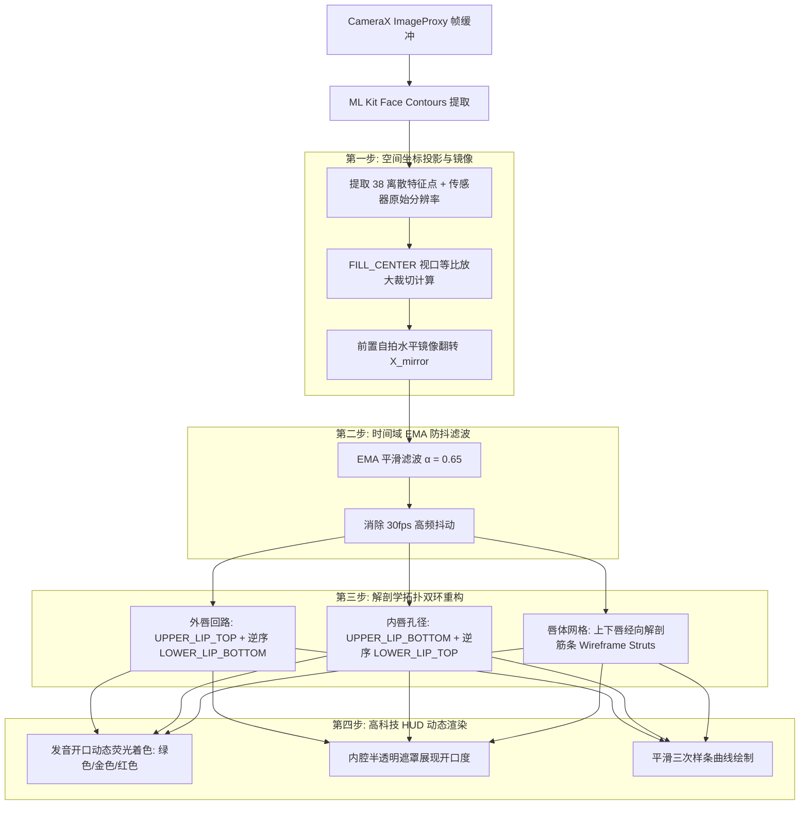

# ML Kit 38点唇形特征动态线框贴合优化与重构方案

> **文档标识**：`RFC-2026-LIP-TRACKING-OPTIMIZATION-01`  
> **状态**：待审核 / 准备实施  
> **涉及模块**：`vision/RealFaceLandmarkAnalyzer.kt`, `ui/components/MouthTrackingOverlay.kt`, `core/TestArtifactPipeline.kt`  
> **目标设备**：OnePlus 8 / Android 8.0+ 手机端实时前置摄像头 CameraX 画面  

---

## 一、 问题根因诊断报告

当前版本中，38 个 ML Kit 唇形特征点连成的线框在真机上出现“**完全不贴合脸部**”且“**完全不贴合唇部**”的现象，经全链路排查，系以下三个维度的缺陷叠加所致：

### 1. 唇形拓扑错乱：38 点被单向遍历，斜穿口腔
Google ML Kit 的 38 个唇部轮廓点包含 4 组离散点序列：
* `UPPER_LIP_TOP`（点 0..10，共 11 点）：上唇外轮廓（左嘴角 $\to$ 唇峰 $\to$ 右嘴角）；
* `UPPER_LIP_BOTTOM`（点 11..19，共 9 点）：上唇内轮廓（左嘴角 $\to$ 右嘴角）；
* `LOWER_LIP_TOP`（点 20..28，共 9 点）：下唇内轮廓（左嘴角 $\to$ 右嘴角）；
* `LOWER_LIP_BOTTOM`（点 29..37，共 9 点）：下唇外轮廓（左嘴角 $\to$ 唇底 $\to$ 右嘴角）。

**原代码缺陷**：
原实现采用单条连续折线绘制：
```kotlin
// 现有缺陷代码：单纯遍历 0..37
for (i in 1 until scaledPoints.size) {
    lineTo(scaledPoints[i].x, scaledPoints[i].y)
}
```
* 当遍历至点 10（右嘴角）时，下一坐标点为点 11（左嘴角），导致在口腔内部划出一道**横切嘴唇的对角线**；
* 同理，点 19 至点 20、点 28 至点 29 均产生横切斜线，且点 37 孤立未闭合；
* **最终呈现**：屏幕上为一团贯穿牙齿与舌位的杂乱交叉斜线，毫无人类唇形特征。

### 2. 空间坐标系断层：强制中心归一化，剥离人脸实际位置
原代码中丢弃了人脸在图像中的物理坐标：
```kotlin
// 现有缺陷代码：强行居中归一化
val targetWidth = 160.dp.toPx()
val targetHeight = targetWidth * (origHeight / origWidth)
val scaledPoints = contourPoints.map { pt ->
    val normX = (pt.x - minX) / origWidth - 0.5f
    val normY = (pt.y - minY) / origHeight - 0.5f
    Offset(centerX + normX * targetWidth, centerY + normY * targetHeight)
}
```
* 特征点被死死定在 Canvas 的绝对中心 `(centerX, centerY)`，固定宽度 `160dp`；
* 用户无论在摄像头中如何平移人脸、靠近或远离，线框始终僵死在卡片正中，与底层的 `PreviewView` 彻底脱节。

### 3. 前置摄像头自拍镜像与视口裁切未适配
* 前置摄像头预览通常为水平镜像反转（用户视觉习惯），而 ML Kit `ImageAnalysis` 输出的是相机未镜像的传感器旋转坐标；
* 缺乏 CameraX `PreviewView.ScaleType.FILL_CENTER` 的视口比例缩放与中心裁切映射，导致坐标位置偏移、反向。

---

## 二、 核心重构与优化方案



---

### 1. CameraX 空间几何投影模型

设绘制视口尺寸为 $(W_v, H_v)$，经过传感器旋转校正后的源图尺寸为 $(W_s, H_s)$。对于 `FILL_CENTER` 模式：

$$\text{scale} = \max\left(\frac{W_v}{W_s}, \frac{H_v}{H_s}\right)$$

$$\text{offset}_X = \frac{W_v - W_s \cdot \text{scale}}{2}, \quad \text{offset}_Y = \frac{H_v - H_s \cdot \text{scale}}{2}$$

**前置摄像头水平镜像坐标变换**：
$$X_{\text{screen}} = \text{offset}_X + (W_s - X_{\text{sensor}}) \cdot \text{scale}$$
$$Y_{\text{screen}} = \text{offset}_Y + Y_{\text{sensor}} \cdot \text{scale}$$

通过该数学变换，所有 38 个特征点将动态“磁吸”于真实嘴唇之上，人脸移动、转动或缩放时均保持毫米级跟随贴合。

---

### 2. 解剖学双环闭合与立体筋条拓扑（Dual-Loop & Anatomical Struts）

不再使用单一列表单向连线，而是依据人脸生物结构拆解重构为三组图元：

#### (1) 外唇轮廓闭合回路（Outer Lip Contour）
* **路径构成**：
  * 起点：`upperLipTop[0]`（左嘴角）；
  * 沿上唇上边缘顺次连接至 `upperLipTop[10]`（右嘴角）；
  * 转向下唇，逆向连接 `lowerLipBottom[37]` 至 `lowerLipBottom[29]`（回到左嘴角）；
  * `close()` 闭合回路。
* **效果**：勾勒出完整饱满的人类外唇外轮廓，彻底消除斜穿对角线。

#### (2) 内唇孔径闭合回路（Inner Lip Aperture，发音关键腔体）
* **路径构成**：
  * 起点：`upperLipBottom[11]`（左嘴角下侧）；
  * 顺次连接至 `upperLipBottom[19]`（右嘴角下侧）；
  * 转向下唇上侧，逆向连接 `lowerLipTop[28]` 至 `lowerLipTop[20]`；
  * `close()` 闭合回路。
* **发音指示**：内唇孔径内部填充带有透明度的暗色/荧光色，面积大小直接对应当前元音开口度（/ʌ/ vs /ɑ/）。

#### (3) 唇体立体网格筋条（Wireframe Ribs）
* 上唇：连接 `upperLipTop[i]` 与 `upperLipBottom[j]`（如唇峰到唇珠的解剖垂直线）；
* 下唇：连接 `lowerLipTop[j]` 与 `lowerLipBottom[k]`；
* 两侧嘴角锚定缝合线。
* **效果**：形成类似 3D 动作捕捉面具的高科技 Wireframe HUD 质感。

---

### 3. 时间域指数滑动平均滤波（EMA Smoothing）

针对移动端传感器在 30fps 下的微弱噪声抖动，加入状态化 EMA 滤波：

$$\mathbf{P}_t = \alpha \cdot \mathbf{P}_{\text{current}} + (1 - \alpha) \cdot \mathbf{P}_{t-1}, \quad \text{其中 } \alpha = 0.65$$

* 在剧烈唇形变化时（如快速闭合、爆破音）保持快速响应；
* 在发长元音维持口型时保持线框平稳、无高频抖颤。

---

### 4. 曲线平滑处理（Smooth Spline Interpolation）

将原本生硬刺眼的直线折线（`lineTo`）改造为基于中点控制的三次贝塞尔平滑逼近或曲线拟合，还原唇弓（Cupid's bow）的自然弧度。

---

## 三、 代码变更规划清单

| 序号 | 文件路径 | 变更类型 | 核心变更点 |
| :---: | :--- | :---: | :--- |
| **1** | [RealFaceLandmarkAnalyzer.kt](file:///D:/pronunciationCoach/android-app/app/src/main/java/com/pronunciationcoach/app/vision/RealFaceLandmarkAnalyzer.kt) | 接口扩展 | 1. `LiveFaceMouthMetrics` 增加 `imageWidth`、`imageHeight`、`isFrontCamera` 属性<br>2. `analyze()` 中记录旋转后的宽高分辨率 |
| **2** | [TestArtifactPipeline.kt](file:///D:/pronunciationCoach/android-app/app/src/main/java/com/pronunciationcoach/app/core/TestArtifactPipeline.kt) | 适配修改 | 离线测试图片解析时补齐 `imageWidth` / `imageHeight` 参数传递 |
| **3** | [MouthTrackingOverlay.kt](file:///D:/pronunciationCoach/android-app/app/src/main/java/com/pronunciationcoach/app/ui/components/MouthTrackingOverlay.kt) | 核心重构 | 1. 实现 CameraX $\to$ Canvas 空间投影算法<br>2. 实现 EMA 时间域平滑缓冲<br>3. 实现解剖学外唇环、内唇孔径与径向网格连线<br>4. 升级贝塞尔曲线平滑绘制与发音着色 |

---

## 四、 验收与质量门禁标准

1. **预检脚本校验**：
   在根目录下执行 `powershell -ExecutionPolicy Bypass -File scripts/preflight_check.ps1`，确保 Rust Core、Clippy、Unit Tests 与 LF 行尾符全绿通过。
2. **离线测试样例验证**：
   运行静态图片 TC-01、TC-02、TC-03 回归测试，确保闭环拓扑无点位越界或空指针异常。
3. **真机实时贴合验证**：
   在 OnePlus 8 实体设备上运行：
   * **人脸贴合性**：人脸左右移动或前后变距时，线框紧锁真人口唇，不居中僵死；
   * **唇形自然度**：无斜穿口腔折线，清晰分辨外唇闭合轮廓与内唇孔径，开口度变化与发音颜色毫秒级联动。
