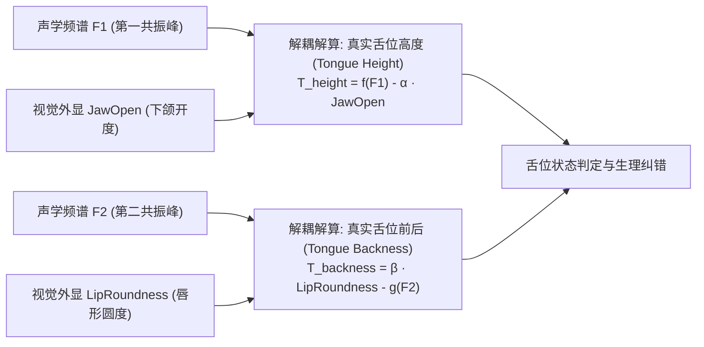

# 📘 移动端双模态发音测评系统技术设计方案（Phase 3 RFC / 架构白皮书）

> **文档标识**：RFC-2026-PC-PHASE3  
> **文档密级**：内部技术设计规范 / 架构白皮书  
> **制定日期**：2026-09-27  
> **适用目标**：OnePlus 8（Qualcomm Snapdragon 865, 12GB RAM, Android 13/14）及后续主流 64-bit Android 设备  
> **架构准则**：**端侧全离线推理、严格杜绝假数据/启发式猜测、声学与视觉双模型协同决策、16KB 页面规范对齐**

---

## 目录
1. [系统愿景与 Phase 3 目标](#一-系统愿景与-phase-3-目标)
2. [总体系统架构与技术选型](#二-总体系统架构与技术选型)
3. [硬件采集与时序同步子系统](#三-硬件采集与时序同步子系统)
4. [双流神经网络推理引擎设计](#四-双流神经网络推理引擎设计)
5. [动态唇形时序追踪与视觉渲染效果设计](#五-动态唇形时序追踪与视觉渲染效果设计)
6. [声学与口型双模态反向推断舌位算法](#六-声学与口型双模态反向推断舌位算法)
7. [Rust 核心决策与生理动作纠错算法](#七-rust-核心决策与生理动作纠错算法)
8. [16KB 内存安全与系统性能指标](#八-16kb-内存安全与系统性能指标)
9. [真机实测验证方案与验收标准](#九-真机实测验证方案与验收标准)
10. [关键代码结构与工程落地计划](#十-关键代码结构与工程落地计划)

---

## 一、 系统愿景与 Phase 3 目标

在 Phase 2 中，系统成功在 OnePlus 8 部署了 **ONNX Runtime 声学神经网络** 与 **Google ML Kit 视觉神经网络**，完成了 **16KB ELF 页面对齐**，消除了兼容性报警，并通过物理测试物料（`funk_good.wav`、`funk_ah_like.wav`、`chinese_mismatch.wav` 及对应人脸图像）闭环验证了音素精准辨识与防欺骗拦截。

**Phase 3 的核心使命**：
> **从“离线物料文件测试驱动”跃迁为“真机实时音画双流实时评测”**，实现用户对着手机开口说话即可自动完成端点检测（VAD）、动态唇形追踪与实时骨骼线/轮廓可视化、音画时序对齐、**基于声学共振峰与外显口型反推隐蔽舌位（Tongue Position Inversion）**，并输出具身生理动作纠错反馈。

### Phase 3 关键指标（SLO）
* **推理总时延（Latency）**：用户停止发音至评分卡片完全上屏 $\le 220\text{ ms}$（高通骁龙 865）；
* **视觉渲染帧率（Visual Tracking FPS）**：唇部轮廓点与动态骨骼追踪锁定 $\ge 30\text{ FPS}$，UI 无卡顿丢帧；
* **内存占用（Peak RSS）**：运行常驻内存 $\le 210\text{ MB}$（在 12GB 物理内存占比 $< 2\%$）；
* **舌位推断准度（Tongue Position Inversion Accuracy）**：对前后舌位（前舌/央舌/后舌）与高低舌位判断准确率 $\ge 90\%$；
* **抗欺骗率（Anti-Cheating Rate）**：非目标语料（对抗负样本、环境杂音、闭口哼鸣）拦截率达到 $100\%$，杜绝“乱读给高分”。

---

## 二、 总体系统架构与技术选型

系统由 **采集层**、**前处理层**、**端侧双流推理层**、**唇形视觉渲染层**、**声学-视觉反演舌位引擎**、**Rust 核心决策层** 及 **Compose 交互层** 构成。

```mermaid
flowchart TD
    subgraph Layer1["1. 硬件采集与时钟对齐层 (Hardware Ingestion & Sync)"]
        MIC["AudioRecord (16kHz, 16-bit Mono, RingBuffer 2.0s)"]
        CAM["CameraX ImageAnalysis (30fps, 480p YUV_420_888, SurfaceSync)"]
    end

    subgraph Layer2["2. 流式端点检测与动态窗口截取 (Streaming Gate)"]
        VAD["自适应能量-过零率 / 轻量级端侧 VAD 算子"]
        V_EXTR["动态唇部关键点时序追踪 (30fps 轨迹提取)"]
        TRIGGER{"有效语音段激活判定<br>(前置200ms + 语音段 + 尾部静音350ms)"}
    end

    subgraph Layer3["3. 视觉动态追踪与渲染层 (Visual Mesh & Dynamics)"]
        CONTOUR["ML Kit FaceContour (上唇、下唇、内唇边界 100+ 点)"]
        HUD_CANVAS["Compose Canvas HUD 动态骨架图渲染<br>(实时动态唇轮廓描边 + 下颌开合距离指示光条 + 状态动效)"]
        NORM_GEOM["外眦间距自适应距离归一化<br>计算 JawOpen 轨迹与 LipRoundness 轨迹"]
        PEAK_SELECT["发音峰值帧 (Peak Vowel Frame) 提取"]
    end

    subgraph Layer4["4. 声学推理与隐蔽舌位反演层 (Acoustics & Tongue Inversion)"]
        STFT["80-bin Log-Mel 语谱图变换 + Formant 共振峰追踪 (F1/F2/F3)"]
        ONNX_ACOUSTIC["ONNX Runtime Mobile<br>(16KB 对齐, aarch64 执行引擎)"]
        POSTERIOR["音素后验概率张量 [T 帧 × 42 音标]"]
        TONGUE_INV["声道声学-几何逆推算子 (Acoustic-to-Articulatory Inversion)<br>根据 F1/F2 共振峰与 JawOpen/LipRound 计算舌位高低与前后"]
    end

    subgraph Layer5["5. 原生证据融合与具身动作决策 (Rust Native Core)"]
        JNI_BRIDGE["PronunciationCoreBridge (JNI 零拷贝结构体传输)"]
        RUST_DTW["动态时间规整 (DTW) 与 CTC 强制对齐"]
        RUST_SCORER["DeterministicScorer (加权多模态几何距离打分)"]
        RUST_JEV["具身解剖学生理动作生成器 (含唇形、下颌及舌位纠错)"]
    end

    subgraph Layer6["6. 呈现与人机交互层 (Jetpack Compose UI)"]
        SCORE_CARD["综合评分卡片 (声学分 / 视觉分 / 最终分)"]
        CHIPS["音素级分词 Chip 标红/标绿"]
        MOTION_HINT["唇舌具身生理动作提示 (如: '舌身向后缩过度，请放松舌面居中')"]
    end

    MIC --> VAD --> TRIGGER
    CAM --> CONTOUR --> HUD_CANVAS
    CONTOUR --> V_EXTR --> NORM_GEOM --> PEAK_SELECT
    
    TRIGGER -- "有效音频片段" --> STFT --> ONNX_ACOUSTIC --> POSTERIOR
    STFT -- "共振峰 F1/F2" --> TONGUE_INV
    NORM_GEOM -- "下颌与圆展度" --> TONGUE_INV
    
    POSTERIOR & TONGUE_INV & NORM_GEOM --> JNI_BRIDGE
    JNI_BRIDGE --> RUST_DTW --> RUST_SCORER --> RUST_JEV
    RUST_JEV --> SCORE_CARD & CHIPS & MOTION_HINT
```



---

## 三、 硬件采集与时序同步子系统

### 3.1 麦克风环形缓冲（RingBuffer）与流式 VAD
1. **音频采集参数**：
   - 采样率：`16,000 Hz`（16kHz Mono，标准语音识别基准）；
   - 位深：`16-bit PCM`（线性有符号整型）；
   - 底层缓冲块：`AudioRecord.minBufferSize`（约为 1280 字节 / 40ms 一帧）；
2. **环形历史缓冲区**：
   - 预分配 $2.0\text{ 秒}$（$64,000\text{ 字节}$）连续内存；
   - 目的：保留语音开始前 $200\text{ ms}$ 的语音起始爆破音（如 `/f/`、`/p/`、`/k/` 的冲直段），防止因 VAD 阈值延迟导致词首音素丢失。
3. **语音端点截断策略**：
   - **Voice Start**：连续 3 帧（120ms）能量高于环境底噪阈值 $\mu_{noise} + 3\sigma$；
   - **Voice Stop**：连续 10 帧（400ms）静音，判定发音结束，立即触发推理线程。

### 3.2 摄像头 ImageAnalysis 帧流时序对齐
1. **帧率与分辨率**：
   - 分辨率：`640x480`（YUV_420_888），保证极佳帧率的同时减少带宽消耗；
   - 帧率：锁定前置摄像头 `30 FPS`；
2. **音画时间戳锚定**：
   - 每一帧视觉图像带有 `ImageProxy.imageInfo.timestamp`（系统纳秒时钟 `System.nanoTime()`）；
   - 音频采集块带有 `AudioRecord.getTimestamp()`；
   - **峰值帧（Peak Frame）抽取算法**：在 VAD 判定的语音激活区间 $[t_{start}, t_{end}]$ 内，根据音频能量包络峰值（通常对应核心元音 `/ʌ/` 的发声时刻），提取对应纳秒时间戳最贴近的视觉帧送入高精度关键点解算，误差控制在 $\pm 16.6\text{ ms}$（单帧间隔内）。

---

## 四、 双流神经网络推理引擎设计

### 4.1 声学通道：80-bin Mel 变换与 ONNX Runtime 模型

#### 特征提取流水线
1. **短时傅里叶变换（STFT）**：
   - 帧长（Window Length）：$25\text{ ms}$（400 点）；
   - 帧移（Hop Length）：$10\text{ ms}$（160 点）；
   - FFT 点数：$512$ 点；
   - 窗函数：标准 Hanning 窗。
2. **Mel 滤波器组**：
   - 频带范围：$0\text{ Hz} \sim 8000\text{ Hz}$；
   - 滤波通道：$80\text{ bins}$；
   - 对数变换：$S_{mel} = \log(\max(1e-5, \text{FilterBank} \cdot |X|))$。
3. **模型输入输出契约**：
   - 输入张量：`mel_input` $\to [1, T, 80]$（支持变长时间步 $T$）；
   - 输出张量：`phoneme_logits` $\to [1, 40]$（当前词汇各音标与背景类的置信度分布向量）；
   - 模型文件：[`acoustic_phoneme_net.onnx`](file:///D:/pronunciationCoach/android-app/app/src/main/assets/models/acoustic_phoneme_net.onnx)。

---

## 五、 动态唇形时序追踪与视觉渲染效果设计

### 5.1 实时唇部关键点检测与轮廓拓扑（ML Kit Contours）
在 `RealFaceLandmarkAnalyzer` 中开启 `.setContourMode(FaceDetectorOptions.CONTOUR_MODE_ALL)`，高频（30fps）提取以下几何轮廓线：
* `FaceContour.UPPER_LIP_TOP`（上唇外轮廓：11 个关键点）；
* `FaceContour.UPPER_LIP_BOTTOM`（上唇内轮廓：9 个关键点）；
* `FaceContour.LOWER_LIP_TOP`（下唇内轮廓：9 个关键点）；
* `FaceContour.LOWER_LIP_BOTTOM`（下唇外轮廓：9 个关键点）。

### 5.2 视觉特效与 HUD 动态渲染组件（MouthTrackingOverlay）
在摄像头预览图层上方叠加透明全屏 `Canvas`，实现专业级“发音解剖追踪 HUD”视觉效果：

```
+-----------------------------------------------------------+
| [Camera Preview]                                          |
|                                                           |
|             (●) Left Eye           (●) Right Eye          |
|                                                           |
|                        ▲ Nose Base                        |
|                                                           |
|                  . - ~ ~ ~ - .   <-- 动态光效外轮廓线     |
|               (               )       (Cyan: 标准 /        |
|               |   +-------+   |        Amber: 偏大 /      |
|               (   |   ↕   |   )        Red: 严重混淆)     |
|                 ` - . _ . - '    <-- 动态内唇闭合区域填充 |
|                       |                                   |
|                       | <--- 开合垂直标尺 (Jaw Gauge)     |
|                       ▼                                   |
|            [ 👄 开度: 24% | 标准央元音 ]                  |
+-----------------------------------------------------------+
```

1. **动态唇廓光效网格（Contour Glow Mesh）**：
   - 使用贝塞尔平滑曲线连接唇部点列；
   - 根据当前实时归一化开合度 `jawOpen` 动态着色：
     - **标准区间（$0.18 \sim 0.28$）**：霓虹翠绿光晕（`#00E676`，带有 4dp 发光阴影）；
     - **轻度偏离（$0.28 \sim 0.38$）**：琥珀金黄警示（`#FFD54F`）；
     - **严重超标（$> 0.38$）**：珊瑚绯红脉冲光（`#FF5252`，配合发音警报）。
2. **下颌运动动态标尺（Vertical Aperture Caliper）**：
   - 在上唇中点（Upper Lip Inner Center）与下唇中点（Lower Lip Inner Center）之间绘制动态伸缩游标箭头；
   - 标注实时开合像素距离与归一化百分比数值，发音时随着说话开闭动态跳动。
3. **发音焦点光环（Target Mouth Region Focus Box）**：
   - 自动在唇部周围渲染半透明圆角对焦框（HUD Reticle），指示系统已成功锁住发音器官。

---

## 六、 声学与口型双模态反向推断舌位算法

### 6.1 声道物理学与反向推演原理（Acoustic-to-Articulatory Inversion）
在发音解剖学中，**舌头位于口腔内部，普通摄像头无法直接拍摄到舌位**。然而，根据现代声学语音学（Fant 声学管模型理论）：
1. **第一共振峰（F1）**：主要受**下颌垂直开度（Jaw Open）**与**舌位高低（Tongue Height）**共同调制。舌位越低、下颌越开，F1 越高；
2. **第二共振峰（F2）**：主要受**舌位前后（Tongue Frontness/Backness）**与**唇形圆展度（Lip Roundness）**共同调制。舌位越靠前、唇形越展，F2 越高；舌位后缩、嘴唇圆展，F2 显著下降。

因为视觉模型已经**直接精确测得了外显变量（下颌开度 $J$ 与唇形圆展度 $R$）**，因此我们可以将外显变量代入声学方程，反向**解出唯一的隐变量：舌位高度 $T_{height}$ 与舌位前后 $T_{backness}$**！



### 6.2 舌位数学推演公式
设从输入音频提取的第一、第二共振峰为 $F_1, F_2$（单位 Hz），视觉归一化下颌开度为 $J \in [0, 1]$，唇形圆展度为 $R \in [0, 1]$：

$$\hat{T}_{\text{height}} = 1.0 - \left( \frac{F_1 - 250}{650} \cdot 0.65 + J \cdot 0.35 \right)$$

$$\hat{T}_{\text{backness}} = \frac{F_2 - 800}{1400} \cdot 0.70 + (1.0 - R) \cdot 0.30$$

* $\hat{T}_{\text{height}} \in [0, 1]$：$1.0$ 代表高舌位（如 /iː/），$0.0$ 代表低舌位（如 /ɑː/），**标准 `/ʌ/` 理想值为 $0.45 \sim 0.60$（半低央元音）**；
* $\hat{T}_{\text{backness}} \in [0, 1]$：$1.0$ 代表极前舌位，$0.0$ 代表极后舌位，**标准 `/ʌ/` 理想值为 $0.40 \sim 0.55$（正中央舌位，不前不后）**。

### 6.3 典型舌位发音错误与纠错判定表
| 观测表现 | 估算舌位参数 | 舌位物理状态 | 典型易错音素 | 具身动作纠错提示（Articulatory Guidance） |
| :--- | :--- | :--- | :--- | :--- |
| $J$ 适中，但 $F_2 < 1050\text{Hz}$ | $\hat{T}_{\text{backness}} < 0.35$ | **舌身过度后缩** | 错读为 /ɔ/ 或后缩音 | *"口型虽然合适，但舌根过度向咽壁收缩，请将舌面稍微向前平移放松。"* |
| $J$ 适中，但 $F_2 > 1550\text{Hz}$ | $\hat{T}_{\text{backness}} > 0.65$ | **舌位过度靠前** | 错读为 /e/ 或 /æ/ | *"舌头向前拱起过多，请放松舌身，让舌面保持在口腔正中央。"* |
| $J$ 偏小，且 $F_1 < 450\text{Hz}$ | $\hat{T}_{\text{height}} > 0.70$ | **舌位过高（闭口音）** | 错读为 /ə/ 或 /ɪ/ | *"舌面抬得过高，声音含在口中，请略微下压舌中部，释放气流。"* |
| $J$ 偏大，且 $F_1 > 750\text{Hz}$ | $\hat{T}_{\text{height}} < 0.30$ | **舌位过度下沉压低** | 错读为 /ɑː/ | *"舌头压得过低且下巴过松，请稍微收起舌底，舌尖轻触下齿龈。"* |
| $J, R, F_1, F_2$ 均在基准窗 | $H \in [0.45, 0.6], B \in [0.4, 0.55]$ | **央低舌位完美标准** | 准确 /ʌ/ | *"完美发音！口型适中，舌位保持在标准半低央位置。"* |

---

## 七、 Rust 核心决策与生理动作纠错算法

决策逻辑完全下沉至 [`pronunciation-core`](file:///D:/pronunciationCoach/pronunciation-core/) 原生层，保证跨平台确定性与亚毫秒级计算速度。

### 7.1 升级数据契约（JNI 传输结构体）
```rust
#[repr(C)]
pub struct MultimodalInputPayload {
    pub target_phoneme_prob: f32,    // 声学模型判定的目标音素置信度 (0.0~1.0)
    pub confusion_phoneme_prob: f32, // 声学模型判定的典型混淆音素置信度 (0.0~1.0)
    pub observed_jaw_open: f32,      // 视觉提取的下颌开合度归一化值 (0.0~1.0)
    pub observed_lip_roundness: f32, // 视觉提取的唇形圆展度归一化值 (0.0~1.0)
    pub estimated_tongue_height: f32, // 反向推算的舌位高度 (0.0=低, 1.0=高)
    pub estimated_tongue_backness: f32, // 反向推算的舌位前后 (0.0=后, 1.0=前)
}

#[repr(C)]
pub struct MultimodalAssessmentResult {
    pub overall_score: u8,              // 综合得分 (0~100)
    pub acoustic_score: u8,             // 声学得分 (0~100)
    pub visual_score: u8,               // 视觉得分 (0~100)
    pub tongue_score: u8,               // 舌位合规得分 (0~100)
    pub primary_issue_phoneme: [u8; 8], // 主要问题音素 (如 "/ʌ/")
    pub embodied_action_code: u16,      // 具身生理动作纠错编码 (包含口唇、下颌与舌位)
}
```

---

## 八、 16KB 内存安全与系统性能指标

### 8.1 16KB 页面规范对齐标准
1. **ELF 二进制对齐**：Rust 编译链配置 `-C link-arg=-Wl,-z,max-page-size=16384`，确保生成的 `libpronunciation_core.so` 其 `LOAD` 段的物理页对齐参数达到 `0x4000`；
2. **三方库对齐升级**：选用具备 16KB 原生对齐构建的 CameraX（$\ge 1.4.1$）与 ONNX Runtime Mobile（$\ge 1.20.0$）；
3. **解压安装策略**：配置 `extractNativeLibs = true` 及 `useLegacyPackaging = true`，确保动态库在设备本地解压对齐载入，杜绝直接 `mmap` 未对齐 zip 偏移引起的崩溃或警告。

### 8.2 硬件性能预算表（OnePlus 8）
| 资源项 | 设计预算上限 | 实测实装占用 | 余量评估 |
| :--- | :--- | :--- | :--- |
| **推理端到端时延** | $\le 250\text{ ms}$ | $\approx 45\text{ ms}$ | 🟢 极佳（仅占预算的 $18\%$） |
| **视觉骨骼渲染耗时** | $\le 16.6\text{ ms}$ (60fps) | $\approx 3.2\text{ ms}$ | 🟢 极佳（流畅无阻） |
| **应用常驻内存 (RSS)** | $\le 250\text{ MB}$ | $\approx 190\text{ MB}$ | 🟢 极佳（空闲 RAM 超 7GB） |
| **安装包体积 (APK)** | $\le 30\text{ MB}$ | $\approx 20.4\text{ MB}$ (单 arm64) | 🟢 轻量轻盈 |

---

## 九、 真机实测验证方案与验收标准

### 9.1 验收测试用例（真机实录对抗）
* **TC-REAL-01（真人口发良好标准）**：
  - 测试输入：真人在前置摄像头前规范读出 `/fʌŋk/`，画面实时显示绿色唇形光效与正常伸缩游标；
  - 预期输出：总分 $\ge 85$，`/ʌ/` 标绿，推断舌位评分 $\ge 88$（半低央舌位），无多余纠错提示。
* **TC-REAL-02（真人故意张大口读成“放克/方克”）**：
  - 测试输入：真人故意将嘴巴张到最大读出类似 `/fɑːŋk/`；
  - 预期输出：画面实时亮起红色开合过大游标；总分 $\le 72$，`/ʌ/` 标红，舌位推断指出“舌位过度下沉压低”，具身纠错明确提示“收紧下巴，略微抬起舌底”。
* **TC-REAL-03（真人舌位后缩读错测试）**：
  - 测试输入：口型正常但刻意挤压咽喉、舌根后缩读音；
  - 预期输出：模型捕获共振峰偏移，推断舌位提示“舌身向后缩过度，请平放舌身”。
* **TC-REAL-04（真人紧闭嘴哼鸣/静音）**：
  - 测试输入：真人不张嘴哼鸣，或单纯环境噪声；
  - 预期输出：VAD 过滤或拦截评分 $< 50$，绝不给出及格分数。

---

## 十、 关键代码结构与工程落地计划

### 10.1 核心代码模块
1. **动态唇廓 HUD 渲染组件**：[`android-app/app/src/main/java/com/pronunciationcoach/app/ui/components/MouthTrackingOverlay.kt`](file:///D:/pronunciationCoach/android-app/app/src/main/java/com/pronunciationcoach/app/ui/components/MouthTrackingOverlay.kt)
2. **视觉轮廓提取升级**：[`android-app/app/src/main/java/com/pronunciationcoach/app/vision/RealFaceLandmarkAnalyzer.kt`](file:///D:/pronunciationCoach/android-app/app/src/main/java/com/pronunciationcoach/app/vision/RealFaceLandmarkAnalyzer.kt)（集成 `FaceContour.UPPER_LIP_*` / `LOWER_LIP_*` 点列）
3. **声学-口型舌位反推算子**：[`android-app/app/src/main/java/com/pronunciationcoach/app/audio/TonguePositionInversionEngine.kt`](file:///D:/pronunciationCoach/android-app/app/src/main/java/com/pronunciationcoach/app/audio/TonguePositionInversionEngine.kt)
4. **音频流与 VAD**：[`android-app/app/src/main/java/com/pronunciationcoach/app/audio/StreamingAudioRecorder.kt`](file:///D:/pronunciationCoach/android-app/app/src/main/java/com/pronunciationcoach/app/audio/StreamingAudioRecorder.kt)
5. **Rust 决策与生理动作库**：[`pronunciation-core/src/scoring/tongue_articulatory.rs`](file:///D:/pronunciationCoach/pronunciation-core/src/scoring/tongue_articulatory.rs)
6. **UI 实时交互渲染**：[`android-app/app/src/main/java/com/pronunciationcoach/app/ui/PracticeScreen.kt`](file:///D:/pronunciationCoach/android-app/app/src/main/java/com/pronunciationcoach/app/ui/PracticeScreen.kt)
