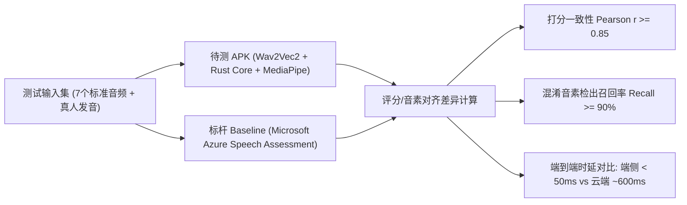
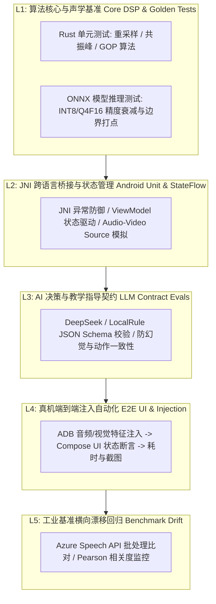
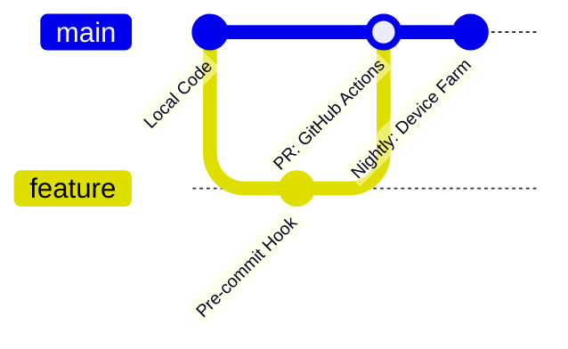

# 多模态英语发音测评系统：对比与自动化测试实施方案

**版本：V0.1**  
**日期：2026-09-27**  
**状态：已规划 / 待推进核验**  
**依据文档：**
- [《英语发音测评网站与技术方案调研总结_V0.1.md》](file:///D:/pronunciationCoach/docs/英语发音测评网站与技术方案调研总结_V0.1.md)
- [《Android 多模态英语发音练习指导系统需求总结与实现路径（Cloud Provider 架构更新）》](file:///D:/pronunciationCoach/pronunciation_coach_requirements_implementation_v0.1_provider_updated.md)

---

## 1. 调研结论分析与技术现状映射

### 1.1 测评能力三层模型与本项目定位

根据工业界主流技术与产品调研，发音测评技术体系呈现清晰的三层结构：

```text
Level 1: 语音识别（Speech Recognition）
└─ “你说了什么词？”
   └─ 目标是文本召回，容错度高，不适用于发音纠偏。

Level 2: 发音评测（Pronunciation Assessment）
└─ “你说得准不准？”
   └─ 代表平台：Microsoft Azure Speech Assessment, SpeechAce。
   └─ 核心能力：音素强制对齐、GOP（Goodness of Pronunciation）、流利度、声学打分。

Level 3: 发音智能指导（Pronunciation Coaching）
└─ “哪里不准？为什么？口型舌位怎么调整？下一步怎么练？”
   └─ 代表产品：ELSA Speak, BoldVoice。
   └─ 核心能力：音素级错误归因 + 视觉唇形/舌位动作指导 + 循序渐进的自适应训练闭环。
```

**本项目定位：**
基于 **“Rust Core + ONNX Wav2Vec2 + MediaPipe + Android Compose + DeepSeek/Local Rule”** 架构，系统在端侧直接跨越至 **Level 3（Multimodal Pronunciation Coaching）**，通过麦克风（声学特征）与前置摄像头（唇形/下颌几何特征）的多模态数据融合，实现可落地、低延迟、可解释的发音私教体验。

### 1.2 工业标杆平台对标矩阵

| 平台 | 核心优势 | 当前系统差距/对标点 | 测试借鉴手段 |
| :--- | :--- | :--- | :--- |
| **Microsoft Azure Speech** | 工业级评测底层能力最全、评分权威稳定 | 端侧离线轻量模型评分分布尚需校准（防过严/过宽） | **黄金基准（Benchmark Baseline）**：用于对齐各音素的打分边界与概率映射 |
| **SpeechAce** | 音素 → 单词 → 句子清晰的分层聚合评分体系 | 需完善音素权重聚合至单词综合分的平滑策略 | **算法参考**：参考其声学特征加权与 CEFR 映射模型 |
| **ELSA / BoldVoice** | 极强的“诊断 → 口型动作指导 → 模仿”教学闭环 | UI 动作指引与针对发音器官的解释可操作性 | **体验对标**：评估 DeepSeek 生成的教学提示是否具体到“下颌开合度/舌尖位置” |
| **Flalingo / Tono** | 浏览器免注册即用、单词快速录音与音素切分直观 | 快速调试验证路径 | **人工对比校验参考**：在快速发音实验中作为即时比对工具 |

---

## 2. 标杆对比测试方案（Benchmarking & Comparative Testing）

为了验证端侧模型与 Rust Core 的评测准确性，必须与工业界顶尖系统进行横向双轨对比。



### 2.1 对比维度与量化指标

1. **评分相关度（Pearson Correlation Coefficient $r$）：**
   - 针对样本集，统计 APK 单词得分与 Azure 单词得分，要求 $r \ge 0.85$。
2. **音素边界偏差（Boundary Delta）：**
   - 比较 CTC 对齐边界与 Azure 标定边界，目标 P50 $< 15.0\text{ ms}$，P95 $< 20.0\text{ ms}$。
3. **典型易混音素召回率（Confusion Matrix Recall）：**
   - 针对特定错误（如 `/ʌ/` 误读为 `/ɑ/`，`/θ/` 误读为 `/s/`，漏尾辅音 `/k/`），对比两者的核心错误识别率（要求召回率 $\ge 90\%$）。
4. **响应延迟与离线可用性：**
   - 记录端到端耗时：APK（离线，P95 $< 50\text{ ms}$） vs Azure（网络往返，通常在 $400\text{--}1200\text{ ms}$）。

### 2.2 测试样本集划分

| 词库分组 | 目标词 (Word) | 目标音标 (Target IPA) | 模拟错误/变体设计 | 现有样本覆盖 |
| :---: | :---: | :---: | :---: | :---: |
| **核心组 1 (重点辅音/元音)** | `funk` | `/fʌŋk/` | 1. 标准发音<br>2. `/ʌ/` 误读为 `/ɑ/` (像 "fah-nk")<br>3. 词尾漏读爆破音 `/k/` | `tests/audio/funk_good.wav`<br>`tests/audio/funk_ah_like.wav`<br>`tests/audio/funk_no_k.wav` |
| **核心组 2 (长短元音对比)** | `ship`<br>`sheep` | `/ʃɪp/`<br>`/ʃiːp/` | 短元音 `/ɪ/` 与长元音 `/iː/` 混淆、时长不足 | `tests/audio/ship.wav`<br>`tests/audio/sheep.wav` |
| **核心组 3 (齿间擦音对比)** | `thin`<br>`sin` | `/θɪn/`<br>`/sɪn/` | 清齿擦音 `/θ/` 误读为齿龈擦音 `/s/` | `tests/audio/thin.wav`<br>`tests/audio/sin.wav` |
| **扩展组 4 (前后开闭元音)** | `bad`<br>`bed` | `/bæd/`<br>`/bed/` | 梅花音 `/æ/` 开口不足发成 `/e/` | *待补充录音/TTS合成* |
| **扩展组 5 (短元音与后元音)** | `hap`<br>`hop` | `/hæp/`<br>`/hɑːp/` | 开前元音 `/æ/` 与开后元音 `/ɑː/` | *待补充录音/TTS合成* |

---

## 3. 五层自动化测试分层体系（Test Architecture）

为了摆脱移动端评测对“现场发音”随机性的依赖，构建五层防御的自动化测试流水线。



### 3.1 各层详细定义

#### L1: 算法核心与声学基准（Core DSP & Golden Tests）
- **覆盖范围：** `pronunciation-core`（Rust crate）及 ONNX 模型推理。
- **验证手段：**
  - `cargo test --lib`：覆盖音频 16kHz 重采样、Pre-emphasis、窗函数、共振峰提取、GOP 计算。
  - `python tools/python/run_verification.py`：载入 `tests/audio/*.wav`，比对预期 `expected/evidence/*.json` 与 `expected/score/*.json`。
- **硬性门禁指标：**
  - 音素时间边界偏差：$\Delta \text{Boundary} \le 15.0\text{ ms}$ (P50), $\le 20.0\text{ ms}$ (P95)；
  - 目标音素后验概率漂移：$\Delta \text{Posterior} \le 0.05$；
  - 端侧 CPU 推理耗时：P95 $\le 50.0\text{ ms}$。

#### L2: JNI 跨语言桥接与状态管理（Android Unit & StateFlow）
- **覆盖范围：** `android-app/app/src/test`。
- **验证手段：**
  - `PronunciationCoreBridgeTest`：高并发与极值输入（如全 0 静音、超长音频、畸形 JSON）防护，验证无 JNI 内存泄漏或 Crash。
  - `PracticeViewModelTest`：验证单词切换（`selectPracticeWord`）、自定词汇音标解析（`setCustomWord`）、多模态特征聚合至 `Evidence JSON` 的完整状态机流程。

#### L3: AI 决策与教学指导契约（LLM Contract Evals）
- **覆盖范围：** `DeepSeekProvider` 与 `LocalRuleProvider`。
- **验证手段：**
  - **JSON Schema 校验：** 输出必须满足包含 `target_word`、`overall_score`、`phoneme_evaluations`、`diagnostic_summary`、`actionable_advice` 的强类型约束。
  - **防幻觉断言：** 严禁出现不在目标单词音标中的虚构音素。
  - **动作指导语义断言：** 当口型特征异常时（如 `jawOpen < 0.25` 时发 `/ʌ/`），纠错建议文本必须命中“张大嘴巴/下颌下沉”等关键指导词。

#### L4: 真机端到端注入自动化（E2E UI & Injection）
- **覆盖范围：** Android 真机（OnePlus 8 / Android 11+）。
- **实现手段（双轨文件/特征注入）：**
  1. 通过 ADB 推送标准 WAV 音频至应用沙盒 `context.filesDir/test_artifacts/`；
  2. 触发应用预埋的 `TestArtifactPipeline` 或 Intent 广播传入对应口型参数（`jawOpen`, `lipRoundness`）；
  3. 执行 UI Automator / Compose UI Test 驱动点击“评测”，断言音素标签（Phoneme Chips）高亮颜色、得分文本、建议卡片内容；
  4. 截取并保存端侧渲染图像至 `results/e2e/`。

#### L5: 工业基准横向漂移回归（Benchmark Drift）
- **覆盖范围：** 云端批处理比对脚本。
- **验证手段：**
  - 自动化脚本批量向 Azure Speech API 和端侧 Core 发送同批样本，计算相关系数矩阵；
  - 若核心指标偏离过大（$r < 0.85$），阻断评分算法的变更合并。

---

## 4. 自动化测试用例矩阵（Test Matrix）

| 用例 ID | 目标单词 | 输入音频 | 输入口型参数 | 核心验证与断言点 | 对应层级 |
| :---: | :---: | :---: | :---: | :--- | :---: |
| **TC-01** | `funk` | `funk_good.wav` | `jawOpen: 0.40, lipRound: 0.15` | 总分 $\ge 85$；各音素状态为正常；UI 无异常警告 | L1, L2, L4 |
| **TC-02** | `funk` | `funk_ah_like.wav` | `jawOpen: 0.58` (开口偏大) | 核心问题音素定位为 `/ʌ/`；得分显著低于 70；提示口型调整 | L1, L3, L4 |
| **TC-03** | `funk` | `funk_no_k.wav` | 标准口型 | 词尾音素 `/k/` 检出极低/缺漏；Primary Issue 标记为 `/k/` | L1, L3, L4 |
| **TC-04** | `ship` vs `sheep` | `ship.wav` / `sheep.wav` | 标准口型 | `/iː/` 时长明显长于 `/ɪ/`；两词音素后验区分度明确 | L1, L2 |
| **TC-05** | `thin` vs `sin` | `thin.wav` / `sin.wav` | `jawOpen: 0.20` | `/θ/` 与 `/s/` 混淆区分度，高频摩擦能量边界验证 | L1, L3 |
| **TC-06** | 异常测试 | 1.5s 全 0 PCM | 无面部 | VAD 拦截；UI 提示“未检测到有效声音”，不崩溃 | L2, L4 |
| **TC-07** | 离线与降级 | `funk_good.wav` | 标准口型 | 无网络状态下自动回退至 `LocalRuleProvider`，100ms 内完成 | L2, L4 |
| **TC-08** | 连续压测 | 连续调用 50 次评测 | 随机参数 | P95 延迟 $< 50\text{ ms}$；JNI 无全局引用泄漏，内存稳定 | L1, L4 |

---

## 5. CI/CD 流水线与质量门禁设计



### 5.1 门禁三级机制

1. **本地 Pre-commit 钩子（< 1 分钟）：**
   - 执行 `cargo clippy -- -D warnings` 与 `cargo test --lib`；
   - 执行快速 Golden 音频用例校验。
2. **PR 合并质量门禁（GitHub Actions，< 5 分钟）：**
   - 验证 ARM64 交叉编译：`cargo build --target aarch64-linux-android`；
   - 执行 Android 单元测试：`./gradlew testDebugUnitTest`；
   - 执行 `python tools/python/run_verification.py`，必须全部 PASSED 并回贴报告。
3. **每日真机大巡检（Nightly Device Farm，~ 20 分钟）：**
   - 自动编译打包并在连接的 Android 设备上通过 ADB 注入音频与口型；
   - 校验 TC-01 至 TC-08 的真机表现与渲染截图；
   - 产生汇总验收报告。

### 5.2 质量门禁红线（Red Lines）

| 监控项 | 门禁阈值 | 触发后果 |
| :--- | :--- | :--- |
| **端侧推理耗时 P95** | $\le 50.0\text{ ms}$ | 超标阻断合并 |
| **音素时间边界偏差 P95** | $\le 20.0\text{ ms}$ | 超标阻断合并 |
| **目标音素后验差 P95** | $\le 0.05$ | 超标阻断合并 |
| **Golden 测试用例通过率** | $100\%$ (7/7 全部通过) | 未满 100% 阻断合并 |
| **端侧稳定性** | Crash = 0, ANR = 0, JNI Panic = 0 | 任何异常阻断发布 |
| **Azure 基准相关度 $r$** | $\ge 0.85$ | 低于阈值告警排查 |

---

## 6. 实施推进计划与验收核验清单（Checklist）

### 6.1 任务分解阶段表

- [ ] **第一阶段（基础设施与工具链固化）：**
  - 编写并固化 `tools/automation/run_e2e_device_tests.py` 真机注入自动化脚本；
  - 编写 `tools/python/compare_with_azure.py` 标杆对比脚本。
- [ ] **第二阶段（测试集补充与真机注入基线建立）：**
  - 补充 `bad/bed`, `hap/hop` 扩展音频集；
  - 采集并校验真实 OnePlus 8 上的全套注入截图与性能打点基线。
- [ ] **第三阶段（评分校准与门禁合流）：**
  - 对比 Azure 输出结果，微调 Rust 端侧 GOP 概率映射与混淆音素阈值；
  - 将自动化测试脚本接入 GitHub Actions 与本地 Pre-flight 检查脚本。

### 6.2 核验验收标准（Sign-off Criteria）

1. **文档完备性：** 本方案与代码仓库中用例、脚本路径 100% 对应；
2. **基准一致性：** 7 个 Golden 音频的比对报告在本地与真机均达成 Spec 指标；
3. **可自动化性：** 开发者无需现场发音，单条命令即可完成全套 L1~L4 回归；
4. **闭环可解释性：** 评测不仅输出分数，且音素卡片、口型警告、AI 纠偏建议三者严格对应。